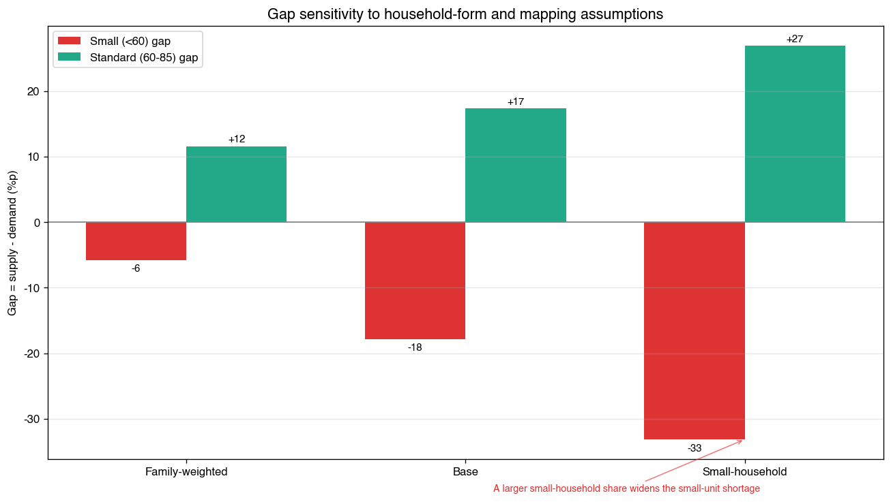
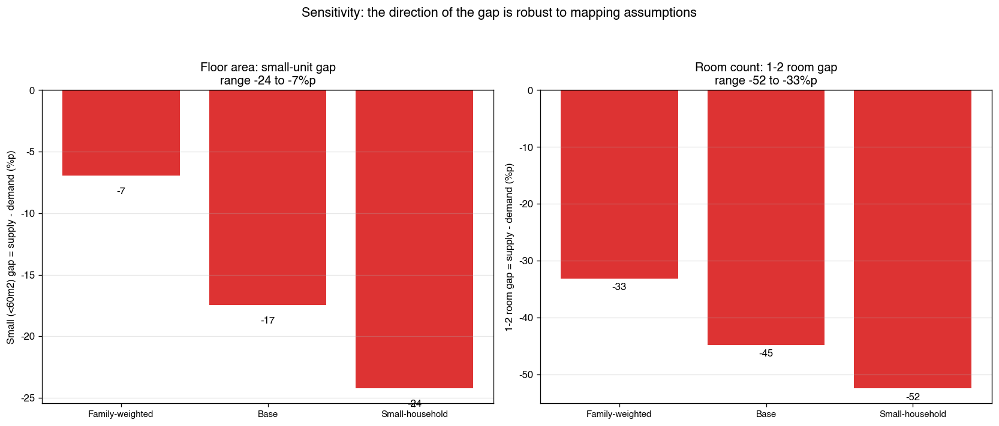
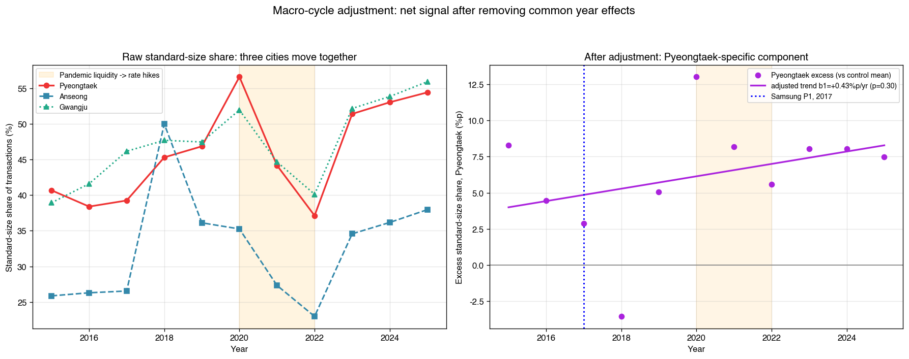
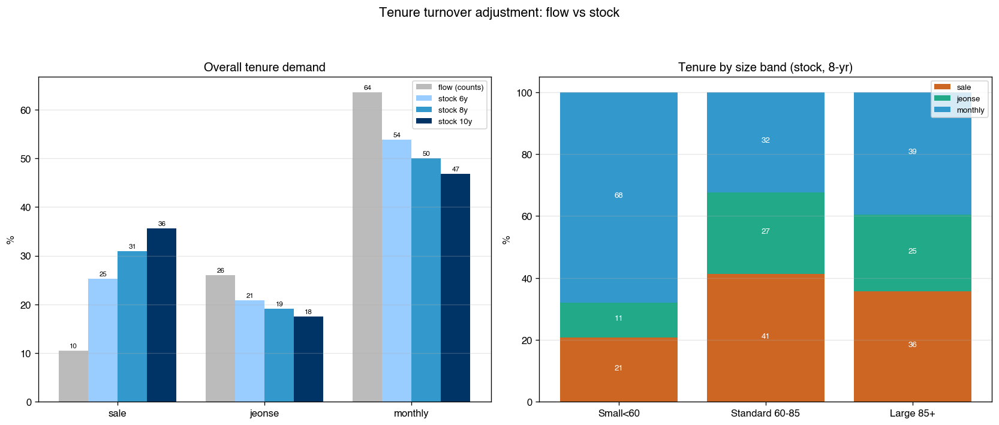
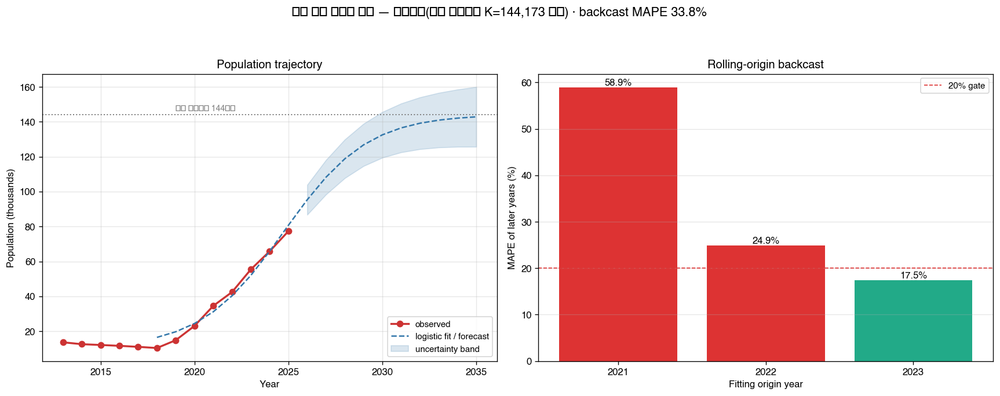

<!-- APPENDIX_v12 (2026-09-18): MANUSCRIPT_v12.md 의 부록.
     v9 본문에 있던 Entity 기호 정의표·검증표·민감도 그림을 이곳으로 이관해 본문을 논지 사슬로 정리했다.
     본문에서 제외된 그림 10종은 PNG·스크립트가 analysis/ 에 그대로 보존되며 원고에서만 제외됐다. -->

*본 부록은 [`MANUSCRIPT_v12.md`](MANUSCRIPT_v12.md)의 부속 자료다. 본문 논지에는 직접 쓰이지 않으나, 기호 정의·모델 검증·가정 민감도를 재현·검증할 수 있도록 분리 수록한다. 투고 시 supplementary material 로 첨부한다.*

 

# 부록 — Entity 기호 체계·모델 검증·가정 민감도
# Appendix — Symbol System, Model Validation, and Sensitivity to Assumptions

**전서연** / SEOYEON JEON

---

## A-1. Entity 기호 체계

본 연구가 사용하는 모든 개체(entity)와 기호를 부표 A1에 통일해 정의한다. 본문의 모든 수식·표와 부속 도구 [`design_simulator.html`](design_simulator.html)가 이 정의를 공유한다.

 **부표 A1. Entity 기호 정의**
**Table A1. Definition of entities and symbols**

| 기호 | Entity | 정의·단위 | 성격 |
|---|---|---|---|
| `a` | 연령밴드 | 5세 구간(20–24 … 85+) 또는 연령군 `g` | 색인 |
| `h` | 가구원수 | 1, 2, 3, 4, 5+ 인 | 색인 |
| `s` | 면적밴드 | 소형<60㎡ / 국평 60–85㎡ / 대형 ≥85㎡ | 색인 |
| `r` | 방수밴드 | 1–2방 / 3방 / 4방+ | 색인 |
| `k` | 점유형태 | 매매 / 전세 / 월세 | 색인 |
| `t` | 연도 | 2013 … 2035 | 색인 |
| `n_a` | 순유입 | 연령대 `a`의 순증(명) | **실측**(DT_1B04005N 차분) |
| `ρ_a` | 헤드십 | 연령별 가구주율(무차원) | **실측**(DT_1JC1511÷인구) |
| `P(h|a)` | 가구원수 조건분포 | 가구주 연령 `a`의 가구원수 분포 | **실측**(DT_1JC1511) |
| `m̄` | 평균 가구원수 | 고덕 관측 앵커(명/가구) | **실측 밴드** 2.99–3.46 |
| `q_h`, `p_h` | 가구원수 분포 | 보정 전 / 보정 후 | 산출 |
| `M^A_(h,s)`, `M^R_(h,r)` | 규격·방수 매핑 | 가구원수→면적·방수 성향 | **가정**(민감도 검증) |
| `T_(s,k)` | 점유성향 | 면적별 매매·전세·월세 비율 | **실측**(회전율 stock 보정) |
| `D^A_s`, `D^R_r`, `D^K_k` | 수요 | 면적·방수·점유별 수요 비중(%) 및 세대수 | 산출 |
| `S_s` | 공급 스톡 | 기 공급 규격 구성(세대·%) | **실측**(단지 메타) |
| `G_s` | gap | `S_s − D^A_s` (음수=부족, 양수=과잉) | 산출 |
| `K_pop` | 계획 수용인구 | 144,173명 (인구 예측의 상한 clip) | **공시**(개발계획) |

Source: 통계청 KOSIS·국토교통부 실거래·NAVER 단지 메타·고덕국제신도시 개발계획.

---

## A-2. 규격매핑 가정의 민감도

본문 §III.3-1)에서 밝힌 대로, 사슬의 입력 중 헤드십 `ρ_a`·조건분포 `P(h|a)`·점유성향 `T_(s,k)`는 실측이고 **규격매핑 `M`만 가정**이다. 따라서 `M`의 변주가 gap의 부호를 뒤집는지가 결론의 강건성을 좌우한다.

세 시나리오(소형 선호 강·기준·대형 선호 강)로 `M`을 변주한 결과, **방수 축 1–2방 부족은 모든 시나리오에서 부호가 유지**된다(−15.7 ~ −25.4%p). 반면 **면적 축은 평균 가구원수 `m̄` 가정에 민감**하여, 1차 산정(m̄=2.18)에서는 소형이 −5.8 ~ −33.2%p 부족으로, 고덕 특화 재추정(m̄=2.99–3.46)에서는 +0.6 ~ +9.5%p 과잉으로 부호가 반전된다. 이것이 본문 §V.2에서 "방수 축 결론은 모수 선택에 강건하고 면적 축은 조건부"라고 서술한 근거다.

**부그림 A1. gap 민감도 — 규격매핑 변주** / **Figure A1. Sensitivity of the gap to mapping assumptions**

Source: 저자 계산(`analysis/21b_gap_sensitivity.py`). ⚠️ 본 그림은 1차 산정(m̄=2.18) 기준이므로, 소형 부족이라는 표시는 §IV.4-(1)에서 기각된 모수에 대한 결과다. 매핑 변주에 대한 **상대적 민감도의 크기**를 읽는 용도로만 해석해야 한다.

**부그림 A3. 설계 사슬의 모델 민감도** / **Figure A3. Model sensitivity of the design chain**

Source: 저자 계산(`analysis/24b_model_sensitivity.py`).

---

## A-3. 규격 '추세'의 전국성 — 배경 검증

본문 §IV.1에서 요약한 배경 검증의 근거다. 국민평형화·소형 감소는 안성·광주(반도체 前 시점)에서도 동일하거나 더 강하게 나타나고, 거시(팬데믹·금리) 사이클을 보정하면 평택 고유 추세가 사라진다. 따라서 본 연구는 규격 '추세' 자체를 반도체 효과로 귀속시키지 않으며, 초점은 **고덕의 국지 인구 구조와 공급 규격의 정합성**에 있다.

**부그림 A2. 규격의 전국성 — 거시 사이클 보정** / **Figure A2. Nationwide nature of the unit-size trend**

Source: 저자 계산(`analysis/08_macro_adjusted.py`).

---

## A-4. 설계 예측모델 — 보정 전/후 대비와 점유 회전율 보정

 **부표 A4. 설계모델 적용 결과(고덕) — 보정 전/후 (Gap = 공급 − 수요, 음수 = 부족)**
**Table A4. Design-model results for Godeok, before and after recalibration**

| 지표 | 보정 前(시 전체 모수) | **보정 後(고덕 특화, 기준 m̄=3.23)** |
|---|---|---|
| 신규 유입 1인가구 비율 | 39.3% | **16.1%** |
| 분포의 평균 가구원수 | 2.22명 (관측과 1.2명 괴리) | **3.23명** (관측 정합) |
| 면적 소형 gap | −17.4%p 부족 | **+5.2%p 과잉** |
| 면적 대형 gap | +0.2%p | **−12.5%p 부족** |
| **방수 1–2방 gap** | −44.8%p | **−20.4%p 부족** (방향 유지) |
| 점유(flow→stock 보정) | 매매 31 / 전세 19 / 월세 **50%** | 매매 35 / 전세 22 / 월세 **43%** |

Source: 저자 계산(`analysis/24_design_model.py`, `26_tenure_stock_adjust.py`, `32_godeok_recalibration.py`, `36_forecast_design_recalibrated.py`). 보정 전 열은 **기각된 모수**에 대한 결과이며, 재추정과의 대비를 위해서만 제시한다.

점유 축에는 두 단계의 조정이 겹친다. **첫째, flow→stock 보정**이 필요한 이유는 실거래가 **거래 건수**이므로 회전율이 빠른 월세가 과대표집되기 때문이다(원자료 기준 월세 64% → stock 보정 50%). **둘째, 고덕 특화 보정**이 소가구 비중을 줄이면서 소형 수요가 축소되고, 소형에 집중된 월세 성향이 함께 약해져 월세 수요가 50%에서 **43%** 로 한 번 더 내려간다. 두 조정을 모두 적용해도 월세 수요는 여전히 40%대로 대조도시 대비 국지적으로 높으며, 규격 다양화·접근성 결론을 뒤집지 않는다.

**부그림 A4. 점유 회전율 보정 — flow vs stock** / **Figure A4. Tenure turnover adjustment**

Source: 저자 계산(`analysis/26_tenure_stock_adjust.py`).

---

## A-5. 모델 검증 — 타 도시 이식과 시간축 backcast

 **부표 A2. 타 도시 가구원수 예측 오차(MAPE)**
**Table A2. Cross-city prediction error (MAPE)**

| 도시 | MAPE(%) | 해석 |
|---|---|---|
| 평택(자기일관성) | 0.8 | 사슬 기계 정확 |
| 안성(유사 대조) | 6.0 | 양호한 이식 |
| 화성(가족 多 신도시) | 11.0 | 소가구 과대예측(국지차) |

Source: 저자 계산(`analysis/25_model_validation.py`).

 **부표 A3. 인구 예측 모형의 rolling-origin backcast 비교**
**Table A3. Rolling-origin backcast comparison of population forecast models**

| 모형 | 평균 MAPE(%) | 판정 |
|---|---|---|
| 로지스틱(K 고정) | 33.8 | 기각 — 일관된 과대예측 |
| **선형(최근 3년 기울기)** | **5.6** | **채택** |
| 감쇠 선형(φ=0.8) | 13.3 | 차선 |

Source: 저자 계산(`analysis/31_backcast_validation.py`). origin 2021·2022·2023 각각 이후 연도 예측 오차의 평균.

로지스틱 기각의 의미는 방법론적으로 §V.2의 첫 번째 교훈과 같다. 계획 수용인구를 포화점으로 고정하면 초기 급성장 구간의 기울기가 포화 속도로 과대 외삽되며, 이 편향은 **사후 검증(backcast) 없이는 드러나지 않았다.**

**부그림 A5. 인구 예측 모형 검증 — rolling-origin backcast** / **Figure A5. Backcast validation of the population forecast**

Source: 저자 계산(`analysis/31_backcast_validation.py`).

---

## A-6. 부속 도구의 유입 프로파일 민감도

본문 §IV.7-(6)의 부속 도구 [`design_simulator.html`](design_simulator.html)는 평균 가구원수에 대해 두 모드를 제공한다. ① 연령 구성에서 헤드십으로 추정하고 고덕 실측 편의(관측 3.23 ÷ 추정 2.48 = ×1.30)를 보정하는 **자동 연동 모드**, ② 민감도 확인용 **직접 지정 모드**다. 자동 모드에서 유입 프로파일을 바꾸면 결과가 부표 A5와 같이 움직인다.

 **부표 A5. 유입 프로파일별 결과 — 부속 도구 자동 연동 모드**
**Table A5. Results by inflow profile (simulator, auto-linked mode)**

| 유입 프로파일 | 평균 가구원수 | 1인율 | 소형 gap | 대형 gap | 1–2방 gap |
|---|---|---|---|---|---|
| 고덕 실측형 | 3.23 | 16.2% | +5.2 | −12.6 | −20.3 |
| 젊은 근로 집중형 | 3.01 | 21.2% | +0.6 | −9.9 | **−25.3** |
| 가족 중심형 | 3.57 | 10.7% | +11.4 | **−17.0** | −13.6 |

Source: 부속 도구 산출(`design_simulator.html`). 사업 주체는 자체 수요 전망을 대입해 본 연구의 배합을 재현·수정할 수 있다.

세 프로파일 모두에서 **1–2방 부족과 대형 부족은 부호가 유지**되고 소형은 과잉을 유지한다. 직접 지정 모드에서 평균 가구원수를 2.18(평택시 전체)로 내리면 1차 산정의 "소형 부족" 결론이 재현되므로, 모수 선택이 결론을 어떻게 바꾸는지 직접 확인할 수 있다.

---

## A-7. 원고에서 제외된 도해 목록 (재현용)

아래 도해는 본문의 논지 사슬에 직접 쓰이지 않거나 다른 exhibit 과 중복되어 원고에서 제외했으나, **PNG 파일과 생성 스크립트는 `analysis/` 에 그대로 보존**된다. 재현·확장 시 참조할 수 있다.

| 파일 | 내용 | 제외 사유 |
|---|---|---|
| **`28_supply_structure.png`** | 공급 방수·면적 분포 | **표 2가 동일 수치를 담고 있어 그림이 추가 정보를 주지 않음** |
| **`32_godeok_recalibration.png`** | 재캘리브레이션 3패널 | **통합 그림 3-①~③에 흡수** |
| **`34_barbell_distribution.png`** | 분포 형태 미스매치 3패널 | **통합 그림 3-②~④에 흡수** |
| `13_development_concentration.png` | 개발의 공간 집중(고덕 점유 1→73%) | 본문 그림 1과 동일 메시지 |
| `12_local_premium_gradient.png` | 국지 가격 거리감쇠 | 본문 그림 5(연속거리 hedonic)의 하위집합 |
| `21_gap_index_prototype.png` | 1차 산정 gap 지수 | §IV.4-(1)에서 기각된 모수의 시각화 — 남기면 오독 유발 |
| `16_hedonic.png` | 연식 통제 프리미엄 | 본문 그림 5와 중복 |
| `24_design_model.png` | 설계 사슬 도해 | §III.3-3) 모델식·부표 A4와 중복 |
| `25_model_validation.png` | 타 도시 검증 | 부표 A2(3행)로 충분 |
| `27_forecast_design.png` | 설계 target 궤적 | 본문 그림 6(연도별 로드맵)에 통합. ⚠️ 보정 전 모수 기반(§V.4-(5)) |

---

<b>미투고 학생 원고(초안) — 부록</b>

