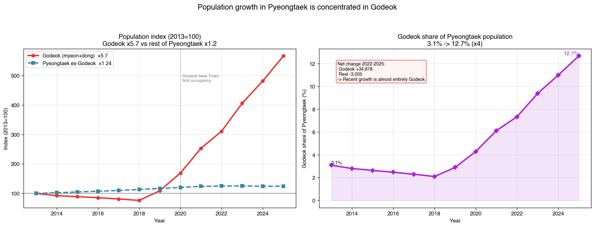
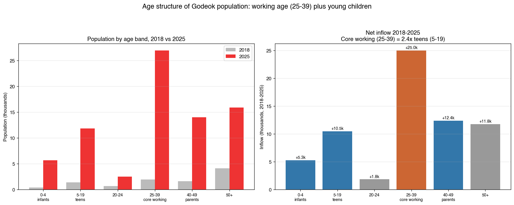
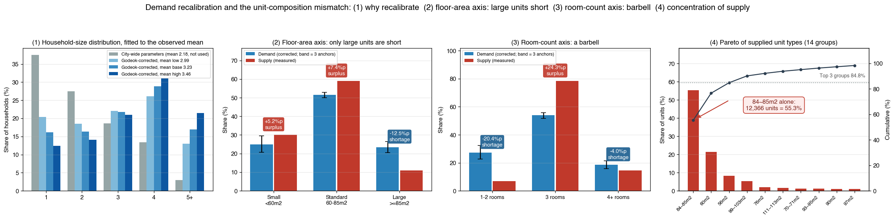
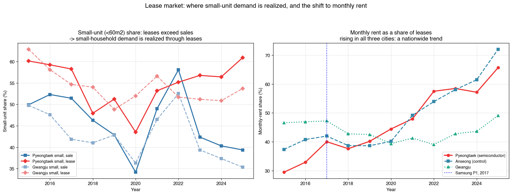
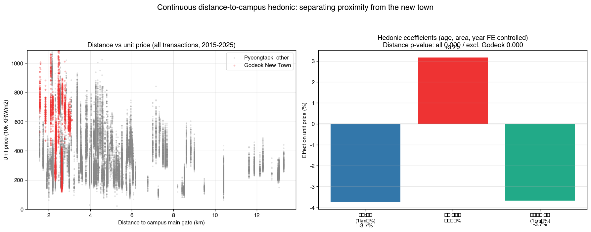
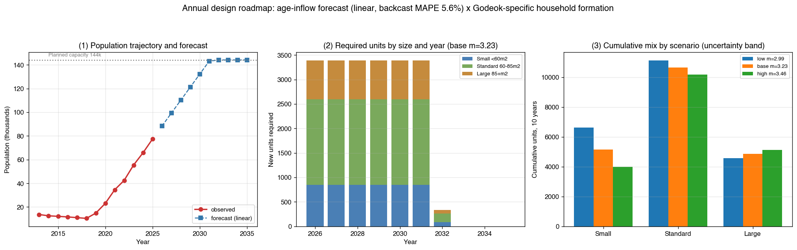
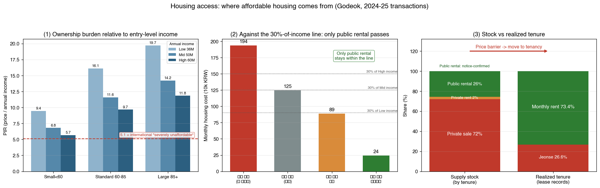

<!-- v11 (2026-08-08): v10 공공임대 총량 확정 + 서술 정비.
     ① 공공임대 재산정 — 경기행복주택 800(모집공고 원문)·LH17 2단지·센트레빌NHF3 확인.
        7,720(25.7%) → 7,720(25.7%), 총 재고 30,088 → 30,088
     ② 공급 주체 재분류 — v10 이 '민간임대'로 본 1,200세대가 실제 LH 공급분(신혼희망타운·행복주택 혼합, 공공임대리츠)
     ③ 자료 기반 명시 — 국토부 실거래 409,585건·NAVER 단지 메타 29,014건 등 원자료 규모를 본문에 기재
     ④ 결론부 문장 정비 — 어색한 술어 정리, 도식·강조 남용 축소
     v10 은 롤백점으로 보존한다. -->
<!-- ⚠️ 실제 저널 ISSN/DOI/배너는 미기재(미게재 학생 원고를 게재본으로 위장하지 않기 위함). -->

*「국토계획」 투고 양식 준용 초안 — 미게재 학생 연구원고. 📎 부록(Entity 기호·검증·민감도) → [`APPENDIX_v12.md`](APPENDIX_v12.md) · 📑 근거 지도 → [`PAPER_GUIDE.md`](PAPER_GUIDE.md) · 부속 도구 [`design_simulator.html`](design_simulator.html) · 개정 이력 [`_CHANGELOG.md`](_CHANGELOG.md)*

<br>

# 반도체 클러스터 주변지역 신도시의 주거 규격은 인구 구조를 반영하는가
### : 고덕 사례와 수요–공급 gap·주거 접근성 기반 규격 다양화 제언<sup>*</sup>

# Does the Housing Unit Composition of a New Town near a Semiconductor Cluster Reflect Its Population Structure?
### : Who Gets Left Out of the New Town? The Godeok Case and a Demand–Supply Gap and Housing-Access Based Proposal for Unit Diversification

<br>

**전서연**<sup>**</sup>
SEOYEON JEON<sup>**</sup>

---

> **Abstract**
>
> In the AI era, the advanced semiconductors that AI depends on can be manufactured at scale in only three countries — the United States, South Korea, and Taiwan — so the clusters that produce them, and the new towns built to house their workforce, will keep being created as a matter of national industrial policy. **This study asks who is left out of housing in such a town.** Taking Godeok New Town beside Samsung's Pyeongtaek Campus, where almost all of Pyeongtaek's net population growth concentrated (population ×5.7), we test whether the housing supplied there is consistent with the population that actually arrived, and then measure who cannot afford it.
>
> Godeok is a **young-family town** rather than a town of single workers (ages 0–14 at **19.4%** against a national 10.3%; ages 65+ at only 6.7%; mean household size **3.0–3.5** versus 2.18 city-wide), so substituting the city-wide single-person share (37.5%) overstates small-unit demand. Re-estimating demand under the observed household-size constraint via a maximum-entropy exponential tilt makes the mismatch axis-specific: on the **room-count axis it is a barbell** — the three-bedroom template is oversupplied by 22.6–26.6pp while both extremes are short (1–2 rooms −15.7 to −25.4pp) — whereas on the **floor-area axis** only large units are short. Supply places 55.3% of all units in a single 84–85㎡ band.
>
> **The consequence falls on housing-vulnerable households.** The observed monthly-rent concentration (73.4% versus 53.5% in the control city) is exclusion, not preference: at a median standard-size price of 580 million KRW the **price-to-income ratio is 16.1** for an entry-level worker (against 5.1 as the international "severely unaffordable" threshold) and mortgage servicing takes **65% of monthly income**. Rent must be split by sector, since public rental supplies **at least 7,720 units (25.7%+ of stock)** and **81% of small-unit rent transactions**: separated, effective rent is **0.24M KRW (5–8% of income) for public units versus 0.89M (18–30%) for private ones**. Affordable housing is therefore supplied almost exclusively through public rental, while the private stock (76%) offers no enterable price point — and public eligibility excludes much of the very inflow the cluster creates (one 1,600-unit complex gives priority to SME workers). Young single-earner, newlywed, and low-income households are thus left in short-term private rent, the most insecure tenure. The problem is not an absence of policy instruments but that **(i) public volume and eligibility are not designed around the cluster's inflow, and (ii) no access condition attaches to private supply**. We formalize an age-inflow-to-design chain, validate it by rolling-origin backcast (linear MAPE 5.6% versus 33.8% logistic), and derive an annual roadmap to 2035 whose conclusions hold across the planning horizon. This is a consistency and access diagnosis, not a causal or optimal-allocation claim.
>
> **Keywords**: semiconductor-adjacent new town, AI semiconductor cluster, housing-vulnerable households, housing unit-size fit, demand–supply gap, housing affordability and access, tenure insecurity, real transaction data

---

**■ 국문 초록** **연구 배경.** 첨단 AI 반도체를 양산할 수 있는 나라는 미국·한국·대만 3개국뿐이어서, 이들 국가에서 반도체 연구·생산이 집중된 클러스터와 그 근로 인구를 수용하는 계획 신도시는 반복해 조성될 수밖에 없다. 그런데 클러스터의 입지·용지·전력은 계획 단계에서 정밀하게 배분되는 반면, **그것이 만들어내는 주거 수요는 같은 수준의 계획 대상이 되지 않는다.**

**연구 목적.** 본 연구는 대표적인 반도체 클러스터 도시인 **한국 평택시(고덕국제신도시)를 분석하여, 클러스터로 유입된 젊은 근로계층의 주거 소외 현상을 규명한다.** 구체적으로 ① 공급 규격이 유입 인구의 가구 구조를 반영하는가, ② 아니라면 무엇을 다양화해야 하는가, ③ 그 결과로 누가 어떤 경로로 소외되는가를 묻는다.

**연구 방법.** 인구(통계청 5세별)·공급(단지 평형·방수 메타)·거래(국토교통부 매매·전월세 실거래)를 결합해 **수요–공급 규격 gap**을 산정하고, 관측 평균 가구원수를 제약으로 두는 **최대엔트로피 지수 기울기**로 지역 특화 재추정을 수행했다. 이어 **접근성 지표**(PIR·월상환 부담률·공공/민간 분리 월세 실질부담)로 소외를 판별하고, 예측 사슬을 rolling-origin backcast로 검증했다(선형 MAPE 5.6%).

**주요 결과.** 평택 인구 순증이 사실상 전부 집중된(×5.7) 고덕은 1인 근로자 도시가 아니라 **젊은 가족 도시**였다(0–14세 **19.4%**·전국 10.3%, 평균 가구원수 **3.0–3.5명**·평택 2.18명). 따라서 시 전체 1인가구율(37.5%)을 쓰면 소형 수요가 과대추정된다. 재추정하면 미스매치가 축마다 달라 **방수 축은 3방 +24%p 과잉·1–2방 −20%p 부족의 양극(barbell)**, **면적 축은 대형만 부족한 단방향**이며 공급은 **84~85㎡ 한 규격군에 55.3%** 가 집중돼 있다. 월세 편중(고덕 73.4% vs 안성 53.5%)은 선호가 아니라 **소외**로 확인된다 — 국민평형 중위가 5.8억원은 초년생 소득 대비 **PIR 16.1배**(국제기준 5.1배)·자가 부담률 **65%** 이고, 소형 월세 거래의 **81%가 공공임대**여서 분리하면 **공공 24만원(소득의 5–8%) vs 민간 89만원(18–30%)** 이다.

**결론 및 시사점.** **감당 가능한 주거는 사실상 공공임대에서만 공급**되고 민간 재고(76%)에는 진입 가격대가 없으며, 공공임대의 소득 기준이 도시근로자 평균에 맞춰져 있어 **연 5,000만원 단독 가구는 영구·국민임대와 행복주택 청년 모두에서 자격을 잃는다**(1,600세대 단지는 중소기업 근로자 우선공급). 그 결과 청년 단독·신혼·저소득 가구는 가장 불안정한 **민간 단기 월세에 남는다.** **정책 질문에 대한 답은 사각지대가 실재한다는 것이다.** 문제는 수단의 부재가 아니라, 공공 물량과 자격이 가구 형성과 도시근로자 평균을 기준으로 짜여 있어 클러스터가 데려온 인구가 그 사이로 떨어진다는 데 있다 — 공공 프로그램에는 소득이 너무 높고, 시장에 진입하기에는 부족하다. 여기에 민간 공급분에는 접근성 조건이 붙지 않는다. 공공이 택지를 조성하고 민간이 대부분을 공급하는 구조에서 실효적 개입 지점은 **택지 공급 조건**이므로, 후속 클러스터는 계획 단계에서 청년·신혼 대상 물량·규격·임대료 상한을 사전 배정할 것을 제안한다. 단, 이는 인과·최적량의 단정이 아니라 정합성·접근성 진단이다.

**주제어**: 반도체 주변지역 신도시, AI 반도체 클러스터, 주거 취약계층, 주거 규격 정합성, 수요–공급 gap, 주거 접근성, 점유 불안정, 실거래가

<sub>* 본 연구는 학생 연구과제로 수행되었으며, 국토교통부 실거래가·통계청 KOSIS·네이버 부동산 공개 데이터를 활용하였다.</sub>
<sub>** Valor International Scholars (제1저자·교신저자). E-mail: seoyeon.jeon@valorschool.org, alisnaea43@gmail.com</sub>

---

## I. 서론

### 1. 연구의 배경

**AI 시대의 주거 문제로서.** AI 연산을 담당하는 첨단 반도체(선단 로직 및 고대역폭 메모리)를 상업적 규모로 양산할 수 있는 나라는 현재 **미국·한국·대만 3개국에 국한**된다.<sup>1)</sup> 이 소수 국가 집중은 곧 **해당 국가에서 반도체 클러스터 조성이 반복될 수밖에 없다는 것**을 뜻한다. 클러스터는 국가 산업정책의 대상이므로 입지·용지·전력·용수는 계획 단계에서 정밀하게 배분되지만, 그 클러스터가 만들어내는 **주거 수요는 같은 수준의 계획 대상이 되지 않는다.** 즉 고덕에서 관찰되는 주거 문제는 일회적 사건이 아니라, AI 반도체 공급망을 보유한 국가가 반복적으로 재생산하는 구조적 문제다.

반도체 산업은 주변지역에 계획 신도시를 만들고 젊은 근로 인구를 집중시킨다(Greenstone et al., 2010). 삼성전자 평택캠퍼스(P1 2017·P2 2020·P3 2022)의 가동과 함께 고덕국제신도시가 조성되었고, 인구·개발·주택 가격이 빠르게 재편되었다. 통념은 "가족 유입 → 국민평형(3방) 수요"이지만, 유입의 무게중심이 통념과 다르다면 통념대로 지어진 공급은 수요와 어긋날 수 있다. 그러나 이러한 신도시에 공급되는 주거 **규격**(면적·방수·점유형태)이 실제 유입 인구의 연령·가구 구조와 정합하는지는 검증된 바 없다.

**본 연구의 초점은 그 어긋남을 감당하는 주체다.** 규격 불일치는 단순한 시장 비효율에 그치지 않는다. **공급 계획이 특정 가구형태를 표준으로 전제하면, 그 표준 밖에 있는 가구는 계획 단계에서부터 비가시화된다.** 표준 규격은 그 규격을 감당할 수 있는 소득 계층을 함께 전제하기 때문에, 규격의 단일화는 곧 진입 가능한 가구의 단일화로 이어진다. 그 결과를 부담하는 것은 **주거 취약계층** — 청년 단독가구, 신혼·예비 신혼부부, 저소득 근로 가구, 그리고 공공임대 입주자격의 우선순위에서 밀리는 가구다. 이들은 통계상 "수요 없음"으로 처리되거나, 시장의 가장 불안정한 층위(단기 월세)로 밀려나 계획의 시야에서 사라진다. 따라서 규격 정합성 진단은 "무엇이 얼마나 어긋났는가"에서 멈출 수 없고, **"그 어긋남의 결과로 누가 소외되는가"** 까지 물어야 한다. 본 연구는 이 질문을 실거래 기반 주거 접근성(affordability) 지표로 정량화하며(§IV.8), 그 점에서 규격 진단 보고서가 아니라 **주거 취약계층 소외에 관한 분석 보고서**다.

<sub>1) 선단 파운드리(대만·한국·미국)와 HBM(한국·미국)의 양산 능력 보유국을 기준으로 한 서술이다. 설계·장비·소재를 포함한 공급망 전체로 넓히면 참여국은 더 많으나, **완제품 양산 단계**의 집중도가 본 연구의 논지(클러스터 조성의 반복성)와 관련된다. ⚠️ 게재/제출 전 산업통계 원출처(SEMI·미 상무부 CHIPS 보고서 등) 대조 확인 필요.</sub>

### 2. 연구의 목적

본 연구의 질문은 다음과 같다. **① 고덕신도시의 주거 공급 규격은 그 지역 인구를 반영하는가? ② 반영하지 못한다면 어떤 규격을 다양화해야 하는가? ③ 그 불일치의 결과로 누가 주거에서 소외되며, 그 소외는 어떤 경로로 작동하는가? ④ 그렇다면 국가의 주거 지원은 이들에게 닿는가?**

이에 따른 기여는 (1) 인구·공급·거래(매매/전월세) 다층 데이터로 규격 정합성을 진단한 것, (2) 가구형태 기반 수요–공급 gap 프레임워크를 제시한 것, (3) 연령유입에서 규격·방수·점유를 산출하는 예측 사슬을 기호 체계로 정식화하고 타 도시 이식·시간축 backcast 양방향으로 검증한 것, (4) 연도별 설계 로드맵과 부속 계산 도구로 실무 적용 경로를 제시한 것, (5) 주거 접근성 지표(PIR·월상환 부담률·임대 비중)로 소외 메커니즘을 **설계 → 가격 → 경로 분기**의 3단 사슬로 정식화한 것, (6) 비판적 검토로 가정·한계를 투명화하고 초기 판의 결론을 자체 정정한 것이다.

---

## II. 이론 및 선행연구 고찰

### 1. 대형 산업 입지의 지역 효과

대형 산업 입지는 고용·인구·주택시장에 광범위한 지역 효과를 낳는다(Greenstone et al., 2010; Dallas Fed, 2023). 반도체와 같은 첨단산업 클러스터는 특히 젊은 근로 인구를 단기간에 집중시켜, 주변지역 주거의 수요 구조를 통상적 도시와 다르게 만든다.

### 2. 인구 구조와 주택 수요

인구 연령 구조는 주택 수요의 양과 규격을 좌우한다(Mankiw and Weil, 1989). 가구는 인구로부터 형성되며(가구주화·headship), 가구원수 구성이 필요한 주거 규격을 결정한다. 코호트-요인법(cohort-component)은 연령별 인구로부터 가구를 추계하는 표준 방법이다(Zeng et al., 2014). 본 연구의 설계 예측모델은 이 접근을 규격·방수·점유 설계로 확장한다.

### 3. 수요–공급 정합성(격차) 진단

주택 공급이 수요와 얼마나 정합하는지를 격차(gap)로 진단하는 접근이 제안되어 왔다(*Journal of Housing and the Built Environment*, 2025). 한국의 1인가구 증가와 소형주택 수요에 관한 논의도 축적되어 있다(대한국토·도시계획학회, 2024). 본 연구는 이 격차 진단을 반도체 주변지역 신도시의 규격 설계에 적용한다.

### 4. 연구의 차별성

기존 연구가 규격 '추세'(국민평형화 등)를 전국 현상으로 다룬 데 비해, 본 연구는 (1) 특정 신도시(고덕)의 국지 인구 구조와 공급 규격의 정합성을 진단하고, (2) 가구원수·가구주연령별 가구원수를 **실측**으로 사용하며, (3) 연령유입에서 규격·방수·점유를 산출하는 예측모델을 제시하고 타 도시로 이식 검증하며, (4) 규격 진단을 **주거 접근성 진단으로 확장**한다는 점에서 차별적이다.

---

## III. 분석 방법론

### 1. 분석의 범위

공간적 범위는 삼성 평택캠퍼스 주변 고덕신도시(평택시 고덕면·고덕동)와 비교 기준으로서 평택시 전역이며, 대조도시로 안성·화성·광주를 사용한다. 시간적 범위는 실거래 2015–2025년, 인구 2011–2025년이다(자료 목록은 표 1). **고덕 판별은 법정동 기준**(고덕동·고덕면)이며 단지명 매칭을 쓰지 않는다(§V.2).

### 2. 분석 데이터

<br>**표 1. 분석 데이터 개요**
**Table 1. Overview of analysis data**

| ID | 자료 | 출처·코드 | 기간 | 파일 |
|---|---|---|---|---|
| D1 | 아파트 매매·전월세 실거래 | 국토교통부 실거래가 | 2015–2025 | `realprice/` |
| D2 | 5세별 인구 | 통계청 KOSIS DT_1B04005N | 2011–2025 | `population/` |
| D3b | 가구원수별 가구(실측) | 통계청 KOSIS DT_1JC1516 | 2015–2024 | `employment/` |
| D3c | 가구주연령×가구원수(실측) | 통계청 KOSIS DT_1JC1511 | 2024 | `employment/` |
| D7 | 단지·평형·방수·세대수·좌표 메타 | 네이버 부동산 (JSON) | ~2026 | master sqlite |
| D8 | 공공임대 입주자모집공고·준공 | LH 청약플러스·마이홈포털 | ~2026 | 공고 확인분 |

<sub>Source: 국토교통부·통계청·NAVER 부동산·LH/GH 공개 데이터. 상세는 `DATA_SOURCES.md`.</sub>

분석에 쓴 자료는 모두 원자료다. 국토교통부 실거래가는 매매 253,255건과 전월세 156,330건(2015–2025)을 내려받아 썼고, 이 가운데 고덕분은 26,710건이다. 인구·가구는 통계청 KOSIS 표를 그대로 인용했으며, 공공임대의 물량과 임대조건은 LH 청약플러스·마이홈포털과 GH의 입주자모집공고에서 확인했다.

여기에 한 가지가 더 필요했다. 주택이 방을 몇 개 갖고 전용면적이 얼마인지는 국가 통계에 집계되지 않는다. 규격 정합성을 묻는 이상 이 정보 없이는 분석이 성립하지 않는다. 그래서 국내에서 이용자가 가장 많은 인터넷 포털인 네이버가 운영하는 부동산 서비스를 이용했다. 이 서비스는 단지별 상세 정보를 JSON 형식으로 제공하는데, 이를 수집·정규화해 전국 6,244개 단지·29,014건의 평형 레코드로 정리했다(평택 319개, 고덕 29개). 방수·전용면적·세대수·임대세대수·좌표가 여기서 나오며, 이 자료가 있어야 인구에서 역산한 규격 수요와 실제 공급 규격을 같은 축에서 비교할 수 있다. 다만 이 자료는 분양·매매 시장을 대상으로 하므로 공공임대 단지는 수록되지 않는다. 그 공백은 §IV.8에서 모집공고 자료로 메웠다.

**로컬 언어모델을 이용한 자료 감사.** 기계로 수집한 29,014건에 기대는 순간 두 가지 문제가 생긴다. 사람이 전수를 볼 수 없다는 것, 그리고 §V.2에 적었듯 이 연구가 세 차례 이름 필드를 실측 필드로 착각했다는 것이다. 두 문제 모두 자료를 언어모델에 감사시켜 다뤘다. 모델은 오픈소스 Gemma 이며 Ollama 로 저자의 컴퓨터에서 로컬 구동해, 자료가 외부로 나가지 않도록 했다.

과제는 둘이었다. 먼저 평택 전체에서 전용면적과 방수를 모두 가진 평형 레코드 1,432건을 배치로 넘겨, 한국 아파트 관행상 함께 성립할 수 없는 조합을 지적하게 했다. 지적은 2건이었고 둘 다 84㎡ 4방으로, 국내에서는 흔한 구성이라 검토 결과 실제 오류는 아니었다. 메타데이터의 내적 정합성이 높고 모델은 과소가 아니라 과다 지적하는 쪽임을 확인했다.

더 쓸모 있었던 것은 두 번째다. 단지명만 주고 공공 공급인지 민간 공급인지 판정하게 했다 — 앞서 이 연구가 틀렸던 바로 그 판단이다. LH·GH 공고로 공급주체가 확인된 13개 단지에 대해 9개를 맞혀 **정확도 69.2%** 였다. 오답 4건은 성격이 같았다. 르플로랑·헤스티블·양우내안애·신동아파밀리에NHF7단지를 민간이 시공했다는 이유로 민간이라 판정했으나, 실제로는 신혼희망타운과 행복주택이 섞인 LH 사업지이거나 공공임대리츠다. 이 연구가 저지른 것과 동일한 오류가 수치로 확인된 셈이다. 단지명만으로는 열에 셋가량을 분류할 수 없고, 실패는 혼합 공급 단지에 정확히 몰린다. 본 연구의 모든 분류가 이름이 아니라 실측 필드에 기대는 실증적 이유가 여기에 있다.

### 3. 분석 방법

**1) 수요–공급 gap 프레임워크.** 가구형태 분포(실측) × 규격수요 매핑(가정)으로 수요 규격비중을 산출하고, 공급 규격비중과 대조한다. **Gap = 공급 − 수요**(`G_s = S_s − D^A_s`)로 정의하며, **음수는 부족**(공급확대 필요), **양수는 과잉**을 뜻한다. 규격수요 매핑 가정은 민감도 분석으로 강건성을 검증한다(부록 A-2).

**2) 캠퍼스 거리 hedonic.** 실거래를 단지 좌표에 매칭하여, 로그 단가를 캠퍼스로부터의 연속거리(km)·신도시 더미·면적·연식·연도 고정효과에 회귀한다(HC0 robust). '공장 근접'과 '신도시 패키지'를 부분 분리한다.

**3) 연령유입 기반 주거설계 예측모델.** 연령대 `a`별 순유입 `n_a`로부터 다음 사슬로 규격·방수·점유·1인비율을 산출한다(하첨자는 `_`로 표기: `H_h`=가구원수 h인 가구, `Σ_a`=연령 a에 대한 합). 기호 전체 정의는 부록 A-1(부표 A1)에 둔다.
```
가구화     H_h    = Σ_a  n_a · ρ_a · P(h | 가구주연령 a)     (ρ = 헤드십, P = DT_1JC1511 실측 조건분포)
규격·방수  D^A_s  = Σ_h  H_h · M^A_(h,s) ,   D^R_r = Σ_h  H_h · M^R_(h,r)
점유       D^K_k  = Σ_s  D^A_s · T_(s,k)                    (T = 고덕 실거래, 회전율 stock 보정)
1인 비율   = H_1 / Σ_h H_h
```
여기서 헤드십 `ρ_a`·조건분포 `P(h|a)`·점유성향 `T_(s,k)`는 **실측**이고, 규격매핑 `M`만 문헌·상식 **가정**이며 민감도로 검증한다.

**4) 고덕 특화 재캘리브레이션.** 위 사슬의 `ρ`·`P(h|a)`는 평택시 전체 모수이므로 고덕에 그대로 적용하면 편향이 생긴다(§IV.2·IV.4). 이를 교정하기 위해 관측된 고덕 평균 가구원수 `m̄`를 제약으로 두고, 사전분포 `q_h`와의 KL 발산을 최소화하는 **지수 기울기(최대엔트로피) 보정**을 적용한다.
```
p_h ∝ q_h · exp(λh) ,   단  Σ_h p_h·h = m̄        (λ은 1차원 근찾기로 결정)
```
`m̄`는 관측 밴드(보수 2.99 / 기준 3.23 / 상한 3.46명)로 두어 결과를 밴드로 제시한다.

---

## IV. 분석 결과

### 1. 고덕신도시로의 성장 집중

평택 인구 순증 중 고덕이 약 38%(2013→2025)를 차지하며, **2022년 이후 순증은 사실상 전부 고덕**이다(고덕 +34,878 / 평택 나머지 −3,005). 고덕 인구는 13,651→77,337명(×5.7), 비중 3.1→12.7%로 늘었다. 신규 아파트 개발 점유율도 1→73%로 급등했고, 외곽 대비 가격배율은 0.96→2.49배(연식통제 시 1.22→1.67)로 벌어졌다. **인구·개발·가격이 모두 고덕 한 곳으로 수렴한다**(그림 1).

**규격 '추세' 자체는 전국 구조라는 점을 먼저 확인해 둔다.** 국민평형화·소형 감소는 안성·광주(반도체 前)에서도 동일하거나 더 강하게 나타나며, 거시(팬데믹·금리) 사이클을 보정하면 평택 고유 추세가 사라진다(부그림 A2). 따라서 본 연구의 초점은 "반도체가 규격을 바꿨나"가 아니라 **"고덕의 특수 인구에 규격 공급이 정합하나"** 이며, 이는 본 연구가 모든 공급 미스매치를 반도체 효과로 귀속시키지 않음을 뒷받침한다.

**그림 1. 고덕 집중 — 고덕 vs 평택(고덕 제외)** / **Figure 1. Concentration in Godeok vs. rest of Pyeongtaek**

<sub>Source: KOSIS DT_1B04005N 기반 저자 작성.</sub>

### 2. 유입 인구의 연령 구조

유입(2018→2025)의 무게중심은 25–39세 근로연령(+24,986명)으로, 청소년 5–19세(+10,451명)의 2.4배, 영유아 0–4세(+5,255명)의 4.8배이다. 다만 영유아·청소년·40대도 대거 증가하여 **"젊은 근로연령 + 어린 자녀"** 의 양상을 보인다(그림 2).

**고덕은 '젊은 1인 근로자 도시'가 아니라 '젊은 가족 도시'다.** 이 구분은 이후 수요 추정을 좌우하므로 정지 상태(stock)의 연령 구성으로 교차 확인했다.

| 지표(2025) | **고덕** | 평택시 | 전국 |
|---|---|---|---|
| 0–14세 비중 | **19.4%** | 12.6% | 10.3% |
| 25–44세 비중 | 45.6% | 31.9% | 26.6% |
| 65세+ 비중 | **6.7%** | 14.6% | 21.2% |
| 아동/부모 비(0–14 ÷ 25–44) | **0.43** | 0.40 | 0.39 |
| 평균 가구원수 | **3.0–3.5명** | 2.18명 | — |

고덕의 아동 비중은 전국의 1.9배이고 고령 비중은 평택시의 절반 미만이다. 평균 가구원수는 고덕 인구(77,337명)를 아파트 세대수(22,368세대)로 나눈 3.46명이 상한이며, 신도시 조성 이전 기저 인구(2018년 10,382명, 구 고덕면 비아파트)를 제외하면 2.99명으로 이것이 보수 하한이다. 두 값 모두 평택시 평균(2.18명)을 크게 상회한다. 따라서 **평택시 전체 1인가구율(37.5%)은 상당부분 구도심 고령 1인가구에서 발생한 값이며, 이를 고덕 수요로 대입하면 소형 수요가 체계적으로 과대추정된다**(§IV.4에서 교정).

**그림 2. 고덕 연령 구성 — 근로연령(25–39) + 어린 자녀** / **Figure 2. Age structure of Godeok inflow**

<sub>Source: KOSIS DT_1B04005N(고덕면·고덕동) 기반 저자 작성.</sub>

### 3. 신축 주거 규격의 공급 구조

고덕신도시 신축 아파트의 규격 구성을 단지 메타(NAVER 부동산) 기준으로 집계했다. 대상은 고덕 소재 **29개 단지·총 22,368세대**이며, 각 세대를 방(침실) 수와 전용면적으로 분류했다(표 2).

**방(침실) 수** 기준으로는 **3방이 17,527세대(78.4%)로 압도적**이고, 4방+ 3,266세대(14.6%), 1–2방은 1,575세대(**7.0%**)에 불과하다. 즉 3방 이상이 전체의 **93.0%**를 차지해, 소형 방수(1–2방)는 사실상 공급되지 않는다. **전용면적** 기준으로도 국민평형(60–85㎡)이 13,188세대(**59.0%**)로 절반을 넘고, 소형(<60㎡)은 6,725세대(30.1%), 대형(≥85㎡)은 2,455세대(11.0%)이다.

요컨대 고덕 신축 공급은 **국민평형·3방이라는 전국 표준 템플릿에 강하게 수렴**한다. 이 공급 구조가 유입 인구의 가구 구조(§IV.2·IV.4)와 정합하는지가 이후 분석의 핵심이다.

<br>**표 2. 고덕 신축 아파트 공급 규격 구성 (29단지·22,368세대)**
**Table 2. Composition of new-apartment unit types in Godeok (29 complexes, 22,368 units)**

| 구분 | 범주 | 세대수 | 비중 |
|---|---|---|---|
| 방수 | 1–2방 | 1,575 | 7.0% |
| 방수 | **3방** | **17,527** | **78.4%** |
| 방수 | 4방+ | 3,266 | 14.6% |
| 면적 | 소형 <60㎡ | 6,725 | 30.1% |
| 면적 | **국민평형 60–85㎡** | **13,188** | **59.0%** |
| 면적 | 대형 ≥85㎡ | 2,455 | 11.0% |

<sub>Source: master sqlite(complexes+pyeong_types) 기반 저자 집계(`analysis/28_supply_structure.py`). ⚠️ 본 집계는 **민간 분양 재고 기준**이며 공공임대 규격은 반영되지 않았다(§V.4-(6)).</sub>

### 4. 수요–공급 규격 gap 지수

**(1) 1차 산정이 성립하지 않는 이유.** 평택 2024년 실측 가구원수(1인 37.5%·2인 27.5%·3인 18.6%·4인 13.4%·5인+ 3.0%, KOSIS DT_1JC1516)를 그대로 대입하는 1차 산정은 소형 −17.8%p 부족·국평 +17.4%p 과잉·대형 +0.5%p를 준다(표 3 첫 열). 그러나 이 분포가 전제하는 평균 가구원수는 **2.18명**이고, 연령유입 사슬(§IV.7)이 산출한 분포의 평균도 **2.22명**인데, 고덕의 관측 평균 가구원수는 **2.99–3.46명**(§IV.2)으로 약 1.2명 괴리가 있다. 즉 1차 산정의 가구 구성으로는 고덕의 실제 인구를 담을 수 없어, 소형 수요가 구조적으로 과대추정된다. 1차 산정값은 **재추정과 대조하기 위한 기준값으로만** 제시한다.

**(2) 고덕 특화 재추정.** 관측 평균 가구원수 `m̄`를 제약으로 두고 §III.3-4)의 최대엔트로피 지수 기울기(`p_h ∝ q_h·exp(λh)`)로 수요 분포를 보정했다. `m̄`는 보수 2.99 / 기준 3.23 / 상한 3.46명의 밴드로 두었다. 보정 전후의 가구원수 분포 변화와 두 축의 gap 교정은 그림 3-①~③에, 산출 결과는 표 3에 제시한다.

<br>**표 3. 고덕 특화 재추정 gap 밴드 (Gap = 공급 − 수요; 음수 = 부족)**
**Table 3. Recalibrated gap band for Godeok**

| 규격 | 1차 산정(m̄=2.18) | **보수(2.99)** | **기준(3.23)** | **상한(3.46)** | 판정 |
|---|---|---|---|---|---|
| 1인가구 비율 | 37.5% | 20.4% | 16.1% | 12.4% | — |
| 소형 <60㎡ | −17.8 | **+0.6** | **+5.2** | **+9.5** | **과잉**(부호 반전) |
| 국민평형 60–85㎡ | +17.4 | +9.1 | +7.4 | +6.2 | 과잉 |
| 대형 ≥85㎡ | +0.5 | **−9.5** | **−12.5** | **−15.5** | **부족**(신규) |
| 1–2방 | −45.5 | **−25.4** | **−20.4** | **−15.7** | **부족**(방향 유지·축소) |
| 3방 | +38.0 | +26.6 | +24.3 | +22.6 | 과잉 |
| 4방+ | — | −6.9 | −4.1 | −1.2 | 부족(경미) |

<sub>Source: 저자 계산(`analysis/21_gap_index_prototype.py`, `32_godeok_recalibration.py`). 규격매핑 M은 1차 산정과 동일하게 두어 분포 교정의 순효과만 분리했다. 매핑 변주에 대한 민감도는 부그림 A1·A3.</sub>

**(3) 공공임대를 넣으면 그림이 달라지며, 그 차이가 곧 발견이다.** 표 3은 단지 메타에 실린 재고, 즉 민간 분양분으로 계산한 값이다. 공공임대는 그 자료원에 없으므로(§IV.8) gap 에도 들어가 있지 않다. 메타가 담지 못한 6,121세대를 LH·GH 입주자모집공고의 평형 구성으로 더하면 — 평형 구성은 6,121세대 전부 공고로 확인했으며, 이 가운데 5,738세대가 전용 60㎡ 미만이다 — 총 재고가 28,489세대가 되고 gap 이 크게 움직인다(표 4).

<br>**표 4. 모집단별 gap (기준 앵커 m̄=3.23)**
**Table 4. Gap by population of stock**

| 규격 | 민간 분양 재고 (22,368) | 전체 재고, 공공임대 포함 (28,489) | 차이 |
|---|---:|---:|---:|
| 소형 <60㎡ | 30.1% → **+5.2** | 44.4% → **+19.5** | +14.3 |
| 국민평형 60–85㎡ | 59.0% → **+7.3** | 47.0% → **−4.7** | −12.0 |
| 대형 ≥85㎡ | 11.0% → −12.4 | 8.6% → −14.8 | −2.4 |
| 1–2방 | 7.0% → **−20.4** | 25.7% → **−1.7** | +18.7 |
| 3방 | 78.4% → **+24.3** | 62.9% → **+8.8** | −15.5 |
| 4방+ | 14.6% → −4.0 | 11.5% → −7.1 | −3.1 |

<sub>Source: 저자 계산. 공공임대 평형은 LH·GH 입주자모집공고에서 확인했다 — LH2단지 16.33·21.2·26.23·36.26㎡ / LH15단지 국민임대 383세대 29~46㎡·영구임대 798세대 26.25㎡·고령자복지 114세대 / LH12단지 26·36·44㎡ / 경기행복주택 18.57~44.81㎡ / LH17단지 16A~36A형 / LH35단지 29.43~46.49㎡. **6,121세대 전부 공고로 확정**했다. 센트레빌NHF3(383세대)는 51~84㎡가 섞여 있는데, LH 공고의 건설호수(51.27㎡ 30 · 59.80㎡ 15 · 74.79㎡ 45 · 84.25㎡ 20 · 84.73㎡ 80 · 84.75㎡ 58 = 248세대)와 단지 총 383세대의 차이 135세대가 공고에 실리지 않은 59.93㎡ 타입이다. 이 타입은 전월세 실거래에서도 점유율 35.1%로 세대 점유율 35.2%와 일치해 교차확인된다. 결과는 소형 180세대(47.0%)·국민평형 203세대(53.0%)다. 혼합 단지 안의 임대 1,200세대는 이미 22,368에 포함돼 있어 다시 더하지 않았다.</sub>

두 열은 서로 다른 것을 말하며 둘 다 사실이다. 소형·소방 주택이 고덕에 없는 것이 아니다. **공공임대를 세면 1–2방 부족은 −20.4%p에서 −1.7%p로 사실상 사라진다.** 다만 그 물량은 시장에서 사는 재고가 아니라 자격 심사로 배분되는 재고 안에만 있다. 자격에 해당하지 않는 가구 — 대기업 사업장 근로자, 우선공급 대상이 아닌 단독 가구 — 에게 유효한 것은 첫 번째 열이고, 거기서 1–2방은 살 수 있는 재고의 7.0%다. 두 열의 차이 18.7%p가 바로 **존재하지만 배분되는 소형 재고**의 크기이며, §IV.8이 다루는 것이 정확히 이 지점이다. 따라서 표 3의 gap 은 고덕에 물리적으로 서 있는 주택의 구성이 아니라 **시장이 공급하는 것의 구성**으로 읽어야 한다.

**(3) 해석 — 축별로 다른 미스매치 형태.** 재추정 결과를 분포 형태로 확인하면(그림 3), 두 축의 미스매치 구조가 서로 다르다.

- **방수 축 = 양극(barbell) 구조.** 수요는 1–2방 27.3%·3방 54.1%·4방+ 18.6%인데 공급은 7.0%·78.4%·14.6%다. 즉 **중간(3방)이 +25.7%p 과잉이고 양쪽 끝(1–2방 −20.3%p, 4방+ −4.0%p)이 모두 부족**하다. 서로 다른 두 세그먼트(자녀 前 젊은 1–2인 / 자녀 있는 가족)의 수요가 각각 미충족인 것으로, 3방 단일 템플릿이 어느 쪽에도 정확히 대응하지 못한다. **이 부호는 `m̄` 밴드 전체와 매핑 변주 전체에서 유지된다.**
- **면적 축 = '대형 부족' 단방향.** 반면 면적 축의 수요 분포는 양봉이 아니라 **가족 쪽으로 이동한 단봉**(최빈 80㎡ 부근)이며, 부족은 대형(≥85㎡) 한 방향에서만 나타난다(−9.5 ~ −15.5%p). 소형은 과잉이다. 따라서 **"양극"이라는 표현은 방수 축에 한정해 사용해야 한다.** 단 면적 축의 부호는 `m̄` 가정에 조건부다(§V.4-(2)).
- **공급 측의 극단성(실측).** 고덕 공급을 전용면적 규격군으로 집계하면 총 **14개 규격군** 중 **84~85㎡ 한 규격군이 12,366세대(55.3%)** 이고, **상위 3개 규격군이 전체의 84.8%** 를 차지한다(그림 3-④). 규격 다양성의 결손은 밴드 비중(국민평형 59.0%)보다 이 규격군 집중도에서 훨씬 선명하다.

즉 처방은 "소형 확대"라는 단선적 형태가 아니라 **"3방·국민평형 단일 템플릿의 완화 + 축별로 다른 보완"** 이다.

**그림 3. 고덕 수요 재추정과 규격 미스매치** / **Figure 3. Demand recalibration and the resulting unit-composition mismatch**

<sub>Source: 저자 계산(`analysis/37_gap_consolidated.py`). ①시 전체 모수(초기 판에서 쓰다 철회한 값)와 고덕 특화 보정 밴드의 가구원수 분포, ②면적 축 수요(보정 후, 오차막대=앵커 3종 밴드) vs 공급, ③방수 축 동일 대조, ④공급 규격군 파레토(막대=비중, 선=누적). ②③의 상자 안 값이 gap(공급−수요)이다. ④의 규격군은 실측 세대수를 1㎡ 버킷으로 집계한 뒤 연속 구간을 병합한 실무 규격군이다.</sub>

### 5. 시장 분화 — 소형 수요의 전월세 실현

고덕에서 매매의 소형 비중(35~44%)보다 전월세의 소형 비중(56~59%)이 높고, 전월세 중 월세 비중이 **73.4%** 에 달한다. 즉 소형·유동 거주 수요는 신축 자가가 아니라 전월세(특히 월세)로 실현된다(그림 4).

**대조도시 검증.** 월세 편중이 고덕 고유 현상인지 전국적 월세화 추세인지 확인하기 위해 대조도시와 비교했다.

| 지역 | 전세 | 월세 | 월세 비중 |
|---|---|---|---|
| **고덕** | 6,758 | 18,643 | **73.4%** |
| 평택시 전체 | 74,363 | 81,967 | 52.4% |
| 안성(대조·반도체 無) | 23,092 | 26,575 | 53.5% |

고덕의 월세 비중은 대조도시(안성 53.5%)와 평택시 전체(52.4%)를 **약 20%p 상회**한다. 즉 월세 편중은 전국 추세가 아닌 **고덕의 국지적 특수성**이며, 본 연구에서 재추정(§IV.4) 이후에도 **가장 강건하게 유지되는 실증 결과**다. 그 원인이 선호인지 소외인지는 §IV.8에서 판별한다.

⚠️ 단, 면적 비중(소형 56~59%)은 **거래 건수 기준**이므로 회전율이 빠른 소형·월세가 과대표집된다. 점유 축은 회전율 stock 보정을 적용했으나(§IV.7), 면적 축의 보정은 후속 과제로 남긴다.

**그림 4. 전월세 — 소형 실재처·월세화** / **Figure 4. Lease market: where small-unit demand is realized**

<sub>Source: 국토교통부 실거래 기반 저자 작성.</sub>

### 6. 공간 근접의 독립 효과 — 캠퍼스 거리 hedonic

고덕 집중이 '캠퍼스 근접' 때문인지 '신도시 라벨' 때문인지 부분 분리하기 위해, 평택 실거래(단지 좌표 매칭 41,196건, 매칭률 58%)에 hedonic 회귀를 적용했다(표 5).

<br>**표 5. 캠퍼스 거리 hedonic 회귀 결과**
**Table 5. Hedonic regression on distance to campus**

| 변수 | 계수(효과) | 유의성 |
|---|---|---|
| 캠퍼스 거리(km) | **−3.7%/km** | p<0.0001 |
| 신도시 더미(고덕, 순프리미엄) | +3.2% | p<0.0001 |
| 고덕 제외 서브샘플(n=37,281) | −3.7%/km | p<0.0001 |

<sub>Source: 저자 계산(`analysis/23_distance_hedonic.py`). 통제변수: ln면적·연식·연도 고정효과, HC0 robust.</sub>

가격 프리미엄의 대부분은 이산적 신도시 라벨(+3.2%)이 아니라 캠퍼스로의 연속 거리(−3.7%/km)에서 온다(그림 5). 신도시가 하나도 없는 서브샘플에서도 −3.7%/km가 유지되어, 근접 효과는 신도시의 산물이 아닌 독립 효과이다. 캠퍼스 기준점을 정문·P2·중앙으로 바꿔도 −2.5 ~ −3.7%/km로 강건하다. 이는 공급 계획의 단위가 행정적 신도시 경계가 아니라 **고용 앵커로부터의 통근 접근성**이어야 함을 시사한다.

**그림 5. 캠퍼스 연속거리 hedonic — 근접 vs 신도시 분리** / **Figure 5. Continuous distance-to-campus hedonic**

<sub>Source: 저자 계산.</sub>

### 7. 연령유입 기반 설계 예측모델과 연도별 로드맵

**(1) 사슬의 적용.** gap 진단을 "연령유입 → 가구형성 → 규격·방수·점유 설계"의 예측 사슬로 일반화한다(모델식은 §III.3-3). 가구주 25–39세는 1인가구 51.4%·1–2인 72.9%(전연령 1인 37.1%)로, 젊은 가구주일수록 소가구가 압도적이다(DT_1JC1511). 이 실측 조건분포와 헤드십(20–24세 0.17 → 40대+ 0.57)을 사슬에 대입해 고덕 유입(2018→2025)에 적용하면, 보정 전 사슬은 시 전체 모수(`ρ_a`·`P(h|a)`)를 사용해 1인가구를 39.3%로 과대 산출하고 분포 평균이 2.22명에 그친다. 고덕 특화 보정(기준 `m̄`=3.23) 후 1인율은 **16.1%**, 분포 평균은 관측과 정합하는 3.23명이 되며, gap은 표 3의 기준 열과 같다. 점유는 회전율 stock 보정으로 매매 10→31·전세 26→19·월세 64→50%로 이동하고(부그림 A4), 여기에 고덕 특화 보정을 더하면 소가구 축소를 거쳐 **매매 35·전세 22·월세 43%** 가 된다. 보정 전/후 대비는 부표 A4에 둔다.

**(2) 검증(이식 가능성·시간축).** 평택에서 캘리브레이션한 파라미터로 타 도시 가구원수를 예측한 결과 **평택 자기일관성 MAPE 0.8%·안성 6.0%·화성 11.0%** 로, 사슬은 광역 구조를 포착하되 도시별 국지차가 존재한다(부표 A2). 시간축 검증에서는 계획 수용인구(`K_pop`=144,173명)를 포화점으로 고정한 로지스틱은 rolling-origin backcast의 모든 origin에서 일관되게 과대예측해 평균 MAPE가 33.8%에 이르렀다. 이를 버리고 **최근 3년 기울기 기반 선형 모형**을 택했으며 MAPE는 5.6%였다(부표 A3·부그림 A5). 원인은 초기 급성장 구간의 기울기를 포화 속도로 과대 외삽한 데 있다(고덕 개발은 당초 계획기간 2008–2022를 넘겨 진행 중이며 2025년 진척률은 계획 인구의 53.6%로, 별도 출처의 사업 진척률 약 52%와 일치한다).

**(3) 연도별 처방.** 채택 모형(선형, `K_pop` 상한 clip)으로 연도별 순유입을 산출하고, 실측 유입 연령 프로파일과 고덕 특화 가구화(기준 `m̄`=3.23)를 적용한 결과는 표 6·그림 6과 같다. 시나리오 밴드는 그림 6에 함께 표시했다.

<br>**표 6. 연도별 필요 신규 세대수 (기준 시나리오 m̄=3.23)**
**Table 6. Annual new-household requirements by unit type (baseline)**

| 연도 | 순유입(명) | 신규가구 | 소형(18평) | 국평(25평) | 대형(31평+) | 1–2방 | 3방 | 4방+ | 월세 물량 |
|---|---|---|---|---|---|---|---|---|---|
| 2026 | 10,958 | 3,392 | 845 | 1,749 | 799 | 927 | 1,832 | 633 | 1,446 |
| 2027–2031 | 각 10,958 | 각 3,392 | 각 845 | 각 1,749 | 각 799 | 각 927 | 각 1,832 | 각 633 | 각 1,446 |
| 2032 | 1,091 | 338 | 84 | 174 | 80 | 92 | 182 | 63 | 144 |
| 2033–2035 | 0 (포화) | 0 | 0 | 0 | 0 | 0 | 0 | 0 | 0 |
| **10년 누적** | **66,836** | **20,692** | **5,151** | **10,666** | **4,875** | — | — | — | — |

<sub>Source: 저자 계산(`analysis/33_annual_design_roadmap.py`). 시나리오 밴드: 누적 신규가구 보수 22,353 / 기준 20,692 / 상한 19,317세대.</sub>

**(4) 계획 물량과의 대조.** 고덕 계획 총 58,300세대에서 기 공급 22,368세대를 차감한 **잔여 약 35,932세대**에 대해, 인구 기반 10년 누적 수요는 **20,692세대(잔여의 58%)** 다. 즉 인구 추세만으로는 계획 물량을 소화하기 어렵고, **계획 잔여 물량이 인구 수요를 상회**한다. 이는 규격 배합의 문제와 별개로 **총량 과잉 위험**을 시사한다(⚠️ 계획 세대수는 전체 주택유형, 공급 실측은 아파트 단지 기준으로 모집단이 달라 상한 근사로 해석해야 한다).

**(5) 계획기간 안정성 — 보정 후 궤적.** 유입지속(A) vs 코호트 성숙(B, 자녀성장·고령화로 연령 프로파일 +1밴드 이동) 시나리오를 고덕 특화 보정을 적용한 상태로 비교했다. 보정계수 `λ`는 **관측 시점(A)을 `m̄` 앵커에 맞춰 1회만 결정하고 같은 `λ`를 B에 적용**했다 — `ρ`·`P(h|a)`가 평택 전체 모수라는 편의는 연령 프로파일이 이동해도 남는 **구조적** 편의이므로 보정계수를 고정하는 것이 옳고, B의 평균 가구원수는 그 결과로 움직이게 두어야 한다(B에 `m̄`를 재강제하면 코호트 성숙의 효과가 정의상 지워진다). 결과는 표 7과 같다.

<br>**표 7. 계획기간 궤적 (2025 → 2035) — 고덕 특화 보정 후, 기준 앵커 m̄=3.23**
**Table 7. Planning-horizon trajectory after Godeok-specific recalibration**

| 지표 | 2025 (A 유입지속) | 2035 (B 코호트 성숙) | 참고: 보정 전 |
|---|---|---|---|
| 평균 가구원수 | 3.23명 | 3.36명 | 2.22 → 2.35명 |
| 1인가구 비율 | 16.0% | 12.9% | 39.3 → 34.2% |
| 1–2방 수요 | 27.2% | 24.2% | 52 → 48% |
| 월세 수요(stock 보정) | 42.9% | 42.0% | 50 → 49% |
| **1–2방 gap** | **−20.2%p** | **−17.2%p** | −44.8%p |
| **3방 gap** | **+25.7%p** | **+22.6%p** | +38.0%p |
| 대형 gap | −12.5%p | −14.1%p | +0.2%p |

<sub>Source: 저자 계산(`analysis/36_forecast_design_recalibrated.py`). 보정 후 2025(A) 값이 §IV.4 표 3의 기준 열(1인율 16.1%·소형 +5.2·1–2방 −20.4·3방 +24.3)을 재현하므로, 사슬과 재추정의 정합성이 교차 확인된다.</sub>

코호트가 성숙하면 1인율(16.0→12.9%)·1–2방 수요(27.2→24.2%)·월세 수요(42.9→42.0%)가 소폭 감소하고 가족 규격 수요가 늘어난다. 그러나 **부호는 계획기간 내내 유지된다** — 3개 앵커 전체에서 2035년에도 3방 +21.3 ~ +24.6%p 과잉, 1–2방 −22.0 ~ −13.0%p 부족, 대형 −17.0 ~ −11.1%p 부족, 소형 +3.7 ~ +12.0%p 과잉이다. 즉 **규격 다양화 결론은 계획기간(2030/2035) 내 유지되며, 성숙에 따라 방수 축의 처방 무게가 1–2방에서 대형·4방+로 다소 이동**한다. 이는 v9까지 보정 전 모수로만 제시되어 수준이 §IV.4와 어긋나 있던 궤적을 재산출한 결과다.

**(6) 실무 활용.** 본 절의 사슬은 부속 도구 [`design_simulator.html`](design_simulator.html)로 구현되어, 연령대별 유입·유입 규모·감쇠율·평균 가구원수를 조정하면 면적 수요 분포 곡선·가구원수 구성·연도별 필요 세대수와 설계 권고가 즉시 재계산된다. 유입 프로파일을 바꿀 때 결과가 어떻게 움직이는지는 부표 A5에 정리했다. 직접 지정 모드에서 평균 가구원수를 2.18(평택시 전체)로 내리면 1차 산정의 "소형 부족" 결론이 재현되므로, **모수 선택이 결론을 어떻게 바꾸는지** 사업 주체가 직접 확인할 수 있다.

**그림 6. 연도별 설계 로드맵 — 평형별 필요 세대수 및 시나리오 밴드** / **Figure 6. Annual design roadmap**

<sub>Source: 저자 계산(`analysis/33_annual_design_roadmap.py`, `27_forecast_design.py`).</sub>

⚠️ **한계**: 선형 모형은 2032년에 계획 인구에 도달해 이후 순유입이 0이 되므로 신규 수요도 0으로 산출된다. 실제로는 포화 후에도 가구 분화(자녀 독립·이혼 등)로 수요가 발생하므로, 2032년 이후 값은 **순유입 기반 수요의 하한**으로 읽어야 한다. 또한 연간 유입을 최근 3년 기울기로 고정했으므로 캠퍼스 증설(P4·P5) 일정 변경 시 재추정이 필요하다.

---

### 8. 누가 소외되는가 — 가격 장벽과 경로 분기

§IV.4는 공급 규격이 가구 구조와 어긋나 있음을, §IV.5는 억눌린 소형·소방 수요가 매매가 아닌 전월세(월세 73.4%)로 우회 실현되고 있음을 보였다. 그러나 "왜 우회하는가"는 아직 열려 있다. 경쟁 설명은 두 가지다. **(가) 선호** — 젊은 근로자는 이동성이 높아 자발적으로 월세를 택한다. **(나) 소외** — 자가 진입 가격이 소득으로 감당 불가능해 밀려난다. 두 설명은 정책 함의가 정반대이므로(전자는 개입 불요, 후자는 개입 필요) 판별이 필요하다. 본 절은 실거래 기반 접근성 지표로 이를 가른다.

**(1) 자가 진입 장벽.** 2024–25년 고덕 아파트 매매 실거래에서 국민평형(60–85㎡) 중위가는 **5.8억원**(n=905)이다. 사회초년생 연소득 3개 시나리오(보수 3,600만·중간 5,000만·고소득 6,000만원)에 대해 PIR(가격÷연소득)과 월상환액(LTV 70%·금리 4%·30년 원리금균등 가정)을 산출하면 표 8과 같다.

<br>**표 8. 규격별 자가 진입 장벽 (고덕, 2024–25 실거래)**
**Table 8. Entry barriers to ownership by unit type**

| 규격 | 중위 매매가 | 자기자본(30%) | 월상환액 | PIR 3,600만 | PIR 5,000만 | PIR 6,000만 | n |
|---|---:|---:|---:|---:|---:|---:|---:|
| 소형 <60㎡ | 3.40억원 | 1.02억원 | 114만원 | 9.4배 | 6.8배 | 5.7배 | 557 |
| **국민평형 60–85㎡** | **5.80억원** | **1.74억원** | **194만원** | **16.1배** | **11.6배** | **9.7배** | 905 |
| 대형 ≥85㎡ | 7.10억원 | 2.13억원 | 237만원 | 19.7배 | 14.2배 | 11.8배 | 95 |

<sub>Source: 국토교통부 실거래가(2024–2025), 저자 계산. 가격은 중위값. PIR·월상환액은 명시된 가정 하 산출치.</sub>

국제적으로 통용되는 주택 부담능력 기준(Demographia)에서 PIR 5.1배 이상은 "심각하게 감당 불가(severely unaffordable)"로 분류된다. 고덕 국민평형은 **보수 시나리오 16.1배로 그 3.2배**이며, **고소득 시나리오(연 6,000만원)에서도 9.7배로 기준의 약 2배**다. 즉 소득 수준을 낙관적으로 잡아도 초년생의 국민평형 자가 진입은 성립하지 않는다.

**(2) 월 주거비 부담 — 자가는 불가, 감당 가능한 임차는 공공뿐.** 동일 규격에 대해 자가 월상환액과 월세 실질부담(월세 + 보증금의 전월세전환 상당액, 전환율 5.5% 적용)을 월소득 대비 비율로 비교하면 표 9과 같다. **월세는 반드시 공공/민간을 분리해 읽어야 한다** — 소형 월세 거래의 **81%(4,570/5,617건)가 공공임대**여서, 분리하지 않은 혼합 중위값(29만원)은 민간 시장가가 아니다.

<br>**표 9. 월 주거비 부담률 — 자가 상환 vs 월세(공공/민간 분리) (월소득 대비 %)**
**Table 9. Monthly housing-cost burden — ownership vs. rent, public and private separated**

| 규격 | 자가 월상환 | 자가 부담률<br>(3,600/5,000/6,000만) | 월세 — **공공** | 공공 부담률 | 월세 — **민간** | 민간 부담률 | 월세 n |
|---|---:|---:|---:|---:|---:|---:|---:|
| 소형 <60㎡ | 114만원 | 38 / 27 / 23% | **24만원** | **8 / 6 / 5%** | **89만원** | **30 / 21 / 18%** | 5,617<br>(공공 4,570·민간 1,047) |
| **국민평형 60–85㎡** | **194만원** | **65 / 47 / 39%** | (분리 미실시) | — | **125만원** | **42 / 30 / 25%** | 1,779 |
| 대형 ≥85㎡ | 237만원 | 79 / 57 / 47% | (분리 미실시) | — | 126만원<sup>†</sup> | 42 / 30 / 25% | 313 |

<sub>Source: 국토교통부 실거래가(2024–2025), 보증금 전월세전환율 5.5% 적용, 저자 계산. 감당선은 통상 월소득의 30%. 소형 공공 24만원의 내부 분해 — 명시 단지 27만원(n=3,460)·번호단지 추정 21만원(n=1,110). <sup>†</sup>국평·대형은 표본이 작아 공공/민간 분리를 실시하지 않았으므로 **혼합값**이며, 공공 물량이 소형 중심(16~44㎡)임을 감안하면 민간 실제값은 이보다 높을 수 있다.</sub>

주거비가 소득의 30%를 넘으면 "부담 과다(cost-burdened)"로 분류하는 통상 기준을 적용하면, **국민평형 자가는 세 소득 시나리오 모두에서 감당선을 초과**한다(39–65%). 임차로 옮겨가도 **민간 소형은 30/21/18%로 감당선에 걸리고**, 민간 국민평형은 42/30/25%로 넘는다. 감당선 안쪽에 확실히 들어오는 것은 **공공임대 소형(5–8%)뿐**인데, 그 자격 기준이 도시근로자 평균에 맞춰져 있어 연 5,000만원 단독 가구는 영구·국민임대와 행복주택 청년 모두에서 자격을 잃는다(§IV.8-(3-1)). 자가와 임차, 그리고 민간과 공공 사이의 이 격차는 선호로 설명되지 않는 크기이며, 설명 **(나) 소외**를 지지한다.

**(3) 공급의 점유 구조 — 감당 가능한 주거는 어디서 나오는가.** 소외가 정책 문제가 되려면 밀려난 가구가 정착할 대안이 있어야 한다. 이 대목은 자료를 하나만 봐서는 답이 나오지 않는다. 규격 분석에 쓴 단지 메타(NAVER 부동산)는 분양·매매 시장을 대상으로 하므로 공공임대 단지를 수록하지 않는다. '평택고덕경기행복주택'은 전국 검색에서도 잡히지 않으며, 이 자료만 보면 고덕의 임대는 2,249세대(9.4%)이고 LH 공급은 한 건도 없는 것처럼 보인다. 그러나 국토교통부 전월세 실거래에서는 고덕 10,190건 가운데 공공임대 단지의 거래가 49.3%를 차지한다. 자료가 비어 있었을 뿐 물량은 있었다. 그래서 단지 메타에 LH·GH 입주자모집공고와 준공 자료를 합쳐 재고를 다시 집계했다.

<br>**표 10. 고덕 공공임대 단지**
**Table 10. Public rental complexes in Godeok**

| 단지 (블록) | 세대수 | 유형 | 근거 |
|---|---:|---|---|
| 평택고덕 LH2단지 (A-6) | 1,600 | 행복주택 — 대학생·신혼부부·주거취약·저소득. **일자리연계형(중소기업 근로자 우선공급)** | LH 입주자모집공고 |
| 평택고덕 LH15단지 (A-58) | 1,295 | 국민임대·영구임대·고령자복지주택 | 준공 자료 |
| 평택고덕 LH12단지 (A57-1) | 900 | 행복주택 (26·36·44㎡) | LH 입주자모집공고 |
| 고덕서정리역 경기행복주택 (A-62) | 800 | 행복주택 — 대학생·청년·사회초년생·신혼부부·고령자·주거급여수급자 | **GH 입주자모집공고 원문** |
| 평택고덕 LH17단지 (Ca1·Ca2블록) | 594 | 행복주택 | **LH 입주자모집공고 원문** |
| 평택고덕 LH35단지 (A-2) | 549 | 국민임대·영구임대 | 준공 자료 |
| 평택고덕 센트레빌NHF3단지 (A-1) | 383 | 10년 공공임대리츠 | 단지 자료(입주 2021.07) |
| **소계 — 전량 임대 단지** | **6,131** | | |
| 고덕국제신도시 다해브 (A-53) | 389 / 1,167 | 신혼희망타운 + 행복주택 | LH 모집공고(공공분양 778+행복주택 389) |
| 신동아파밀리에NHF7단지 (A-10) | 609 / 719 | 10년 공공임대리츠 | 단지 메타 임대세대 |
| 고덕국제신도시 르플로랑 (A-7) | 295 / 891 | 신혼희망타운 + 행복주택 | 단지 메타 임대세대 |
| 고덕국제신도시 헤스티블 (A-3) | 167 / 496 | 신혼희망타운 + 행복주택 | 단지 메타 임대세대 |
| 고덕국제신도시 양우내안애 (A57-2) | 129 / 385 | 신혼희망타운 + 행복주택 | 단지 메타 임대세대 |
| **소계 — 혼합 단지의 임대분** | **1,589** | | |
| 평택고덕 사회임대주택 1차 | 5 | 사회임대주택(다가구) | 건축물대장(2021.01 준공) |
| 평택고덕 사회임대주택 3차 | 5 | 사회임대주택(다가구) | 건축물대장(2022.05 준공) |
| **공공임대 합계** | **7,720** | | |

<sub>Source: LH 청약플러스·마이홈포털 및 GH 입주자모집공고, 준공 자료, 단지 메타(NAVER 부동산) `lease_households`. 아래 네 단지는 분양(신혼희망타운)과 임대가 한 단지에 섞여 있어 임대 세대만 계상했다. 임대율이 세 단지에서 33% 안팎으로 일정한 것은 택지 공급 조건에 따른 배정으로 보인다.</sub>

<br>**표 11. 고덕 아파트 재고의 점유유형**
**Table 11. Tenure composition of Godeok's apartment stock**

| 구분 | 세대수 | 비중 | 자료원 |
|---|---:|---:|---|
| 민간 분양 | 21,708 | 72.1% | 단지 메타 |
| 민간 임대 | 660 | 2.2% | 단지 메타 `lease_households` (어울림스퀘어) |
| **공공 임대 (LH·GH)** | **7,720** | **25.7%** | 모집공고·준공 자료 + 단지 메타 |
| **임대 계** | **8,380** | **27.9%** | |
| 총계 | 30,088 | 100.0% | |

<sub>Source: 저자 집계. 단지 메타에 없는 공공임대 단지 9개(6,131세대)는 분모에도 함께 더했다.</sub>

**(3-1) 가격이 열어준 문을 자격이 닫는다.** 감당 가능한 것과 들어갈 수 있는 것은 다르다. 공공임대는 임대료가 싸지만 소득·자산 기준으로 배분되고, 그 기준선은 도시근로자 평균에 맞춰져 있지 반도체 클러스터가 지급하는 임금에 맞춰져 있지 않다. 본 연구의 소득 시나리오를 현행 기준선과 대조하면 표 11과 같다.

<br>**표 11. 공공임대 소득 상한과 본 연구 소득 시나리오 (연, 만원)**
**Table 11. Income ceilings for public rental against the study's income scenarios**

| 유형 | 1인 | 2인 | 3인 | 고덕 물량 |
|---|---:|---:|---:|---:|
| 영구·국민임대 (도시근로자 평균의 90 / 80 / 70%) | 4,118 | 5,632 | 6,861 | 1,730세대 |
| 행복주택 청년 (100%) | 4,576 | 7,040 | 9,802 | 3,894세대 |
| **시나리오 — 보수 3,600** | 가능 | 가능 | 가능 | |
| **시나리오 — 중간 5,000** | **초과** | 가능 | 가능 | |
| **시나리오 — 고소득 6,000** | **초과** | **초과(영구·국민)** | 가능 | |

<sub>Source: LH 입주자격 기준, 2025년 도시근로자 가구원수별 월평균소득(1인 3,813,363원 · 2인 5,866,270원 · 3인 8,168,429원). 자산 기준도 함께 적용된다 — 청년 총자산 2억 5,100만원, 국민임대 3억 4,500만원, 자동차 4,542만원.</sub>

결과는 분명하다. 연 5,000만원 단독 가구 — 세 시나리오의 가운데이자 대형 반도체 사업장의 통상적 초임 수준 — 는 **영구임대·국민임대·행복주택 청년 모두에서 소득 기준을 넘는다.** 2인 이상 가구를 이루어야 자격이 돌아온다. 도시근로자 평균을 기준으로 설계된 제도가 클러스터가 데려온 인구, 즉 젊고 혼자 살며 그 평균보다 많이 버는 층을 정확히 걸러내는 것이다.

자격 요건은 **가구 형성을 전제로** 쓰여 있고, 그것이 두 번째 필터다. 공공임대는 큰 평형을 기혼자에게 배정한다. 경기행복주택 공고에서 공급대상이 명시된 776호 가운데 **신혼부부 몫이 366호(47.2%)** 로 청년 단독 274호(35.3%)를 웃돌고, 단지 최대 평형인 44.81㎡ 274호는 **전량 신혼부부용**이다. 여기에 혼인 또는 예비혼인을 전제하는 신혼희망타운 계열 980세대(다해브·르플로랑·헤스티블·양우내안애)를 더하면 경향은 분명해진다.

소득 상한도 같은 방향으로 휜다. 1인 가구는 영구·국민임대 4,118만원, 행복주택 4,576만원이지만 2인 가구가 되면 각각 5,632만원과 7,040만원으로 **혼인만으로 37%와 54%가 오른다.** 같은 사람이 같은 급여를 받으면서 혼자일 때는 자격이 없고 결혼하면 자격이 생긴다.

두 필터는 겹쳐서 작동한다. 혼인 이전의 청년 근로자는 열려 있는 물량이 적은 동시에, 넘어야 할 소득선이 모든 가구 규모 중 가장 낮다. 이것이 행정의 실수는 아니다. 신혼·저소득 우대는 출산율과 주거복지 목표에서 나온 것이고 그 자체로 정당하다. 요지는 더 좁다. **가구 형성을 전제로 설계된 제도가, 젊고 미혼이며 평균 이상을 버는 인구의 유입이 정의적 특징인 입지 유형과는 맞지 않는다는 것이다.** 수단이 잘못된 것이 아니라 수단과 장소가 어긋나 있다.

여기에 두 겹의 필터가 더 있다. 가장 큰 LH2단지 1,600세대는 중소기업 근로자에게 우선 공급되므로 앵커 기업 근로자의 순위가 오히려 뒤로 밀린다. 그리고 전용 26.25㎡의 영구임대 798세대(고령자복지 114세대 포함)는 최저소득층과 고령자를 위한 물량으로, 클러스터가 만들어내는 인구와는 대상 자체가 다르다.

§IV.4와 함께 읽으면 논지가 닫힌다. 공공임대를 세었을 때 드러난 18.7%p의 소형 재고는 이 인구가 들어갈 수 있는 재고가 아니다. **자가는 가격으로 닫혀 있고(PIR 16.1배), 민간 임차는 감당선에 걸리거나 넘으며(소득의 18~30%), 감당 가능한 유일한 선택지인 공공임대(5~8%)는 자격으로 닫혀 있다.** 세 문이 같은 가구에게 동시에 닫히고, 남는 것은 단기 민간 월세다.

공공임대는 없는 것이 아니라 오히려 적지 않다. 25.7%는 평택시 전체 임대 비중을 크게 웃돌고 임대료도 감당 범위 안이다(소형 24만원, 소득의 5–8%). 다만 두 가지가 걸린다. 하나는 총량으로, 유입 규모에 비해 넉넉하지 않은 데다 나머지 재고에는 그 가격대가 아예 없다. 다른 하나는 대상이다. 가장 큰 LH2단지 1,600세대는 일자리연계형이어서 중소기업 근로자에게 우선 공급되므로 대기업 사업장 근로자나 그 밖의 청년 가구는 순위에서 밀린다. 클러스터가 만들어내는 유입의 구성과 공공임대의 자격 요건이 서로 맞물려 있지 않다.

공급 주체를 시공사 이름으로 판단하면 실상을 놓친다는 점도 적어둔다. 르플로랑·헤스티블·양우내안애·다해브는 각각 한신공영·진흥기업·양우종합건설·대흥건설이 지었지만 신혼희망타운과 행복주택이 섞인 LH 사업지이고, 신동아파밀리에NHF7단지와 센트레빌NHF3단지는 공공임대리츠다. 민간 건설사가 지었다는 사실과 민간이 공급했다는 사실은 다르다.

**(4) 그럼에도 월세 편중이 관측되는 이유.** 공공임대가 7,720세대 존재하는데도 실현 점유는 월세 73.4%다(§IV.5). 두 사실이 모순되지 않는 이유는 공공임대의 **총량과 대상이 모두 제한적**이기 때문이다. 확인분 25.7%는 유입 규모에 비해 작고, 대상도 한정된다 — 예컨대 LH2단지(1,600세대)는 **일자리연계형으로 중소기업 근로자에게 우선공급**되므로, 대기업 사업장 근로자나 그 밖의 청년 가구는 우선순위에서 밀린다. 즉 문제는 "정책 수단의 부재"가 아니라 **수단의 규모·대상이 클러스터가 만들어내는 유입 구조에 맞춰 설계되지 않았다는 것**이다.

**(5) 문제의 소재 — 수단의 부재가 아니라 규모·대상·부착 조건.** 한국에는 행복주택·국민임대·공공지원민간임대 등 주거 접근성 수단이 제도로 존재하고, 고덕에서 **실제로 작동하고 있다**(표 10). 따라서 문제는 수단의 부재가 아니라 두 가지다. **① 공공 물량의 규모가 유입 인구에 비해 작고 대상이 클러스터 고용 구조와 맞지 않으며, ② 민간 공급분(재고의 76%)에는 접근성 조건이 부착되지 않는다.** 특히 ②가 핵심이다. 민간이 재고의 대부분을 공급하는 구조에서 민간 물량에 감당 가능 가격대가 하나도 없다면, 공공임대를 아무리 늘려도 **그 비중만큼만** 접근성이 개선된다. 고덕은 공공이 택지를 조성하고 민간이 재고의 76%를 공급한 구조이므로, 공공은 자기 공급분 밖에서는 택지 공급 이후 규격·점유·가격대에 개입할 수단을 사실상 잃는다. 개입 지점이 **택지 공급 조건**이어야 하는 이유가 여기에 있다(§V.3).

**(6) 소외 메커니즘의 정식화.** 이상을 연결하면 소외는 3단계로 작동한다.

> **① 설계 단계** — 민간 공급이 3방 국민평형 단일 템플릿으로 표준화된다(3방 78.4%, 84–85㎡ 한 규격군에 55.3%, §IV.3).
> **② 가격 단계** — 그 표준 규격의 가격(5.8억, PIR 16.1배·월상환 부담률 65%)이 초년생 소득의 자가 진입선을 넘고, 민간 임차 역시 소형 89만원·국평 125만원으로 감당선에 걸리거나 넘는다.
> **③ 경로 분기 단계** — 감당 가능한 유일한 경로는 공공임대(5–8%)다. 여기에 진입한 가구는 안정적으로 정착하지만, 총량(25.7%)과 대상 제한(중소기업 근로자 우선 등)으로 **진입하지 못한 가구는 민간 단기 월세로 남는다**. 실현 점유의 월세 73.4%는 이 분기의 결과다.

그림 7는 이 사슬을 PIR·부담률·점유 역전의 세 패널로 종합한다. 사슬의 함의는 규격 다양화가 미학이나 시장 효율의 문제가 아니라 **누가 이 도시에 정착할 수 있는가의 문제**라는 것이다. 대안은 존재하되 **공공 부문에만 존재하고, 민간 부문은 접근 가능한 가격대를 하나도 공급하지 않는다**. §IV.4의 gap이 계획의 언어라면, 본 절의 접근성 지표는 **그 gap이 사람에게 도달한 결과**다.

<br>**그림 7. 주거 접근성 — 왜 젊은 근로자는 월세로 밀려나는가** / **Figure 7. Housing access — why young workers are pushed into monthly rent**

<sub>Source: 국토교통부 실거래가(2024–2025)·NAVER 부동산 단지 메타·LH 공고, 저자 계산. ① PIR과 국제 부담 기준선, ② 자가 상환 vs 월세의 감당선(소득 30%) 대비, ③ 계획 점유(분양 97.0%)와 실현 점유(월세 73.4%)의 역전.</sub>

⚠️ **가정과 한계**: 소득은 실측이 아닌 시나리오이며(고덕 입주 가구 소득 자료 부재), 자가 부담은 LTV 70%·금리 4%·30년 원리금균등, 월세 실질부담은 전월세전환율 5.5%를 가정했다. 공공임대 단지 식별은 실거래 단지명 기반이므로 명목 분류의 한계를 안고 있고, 민간 임대 2,249세대의 프로그램 유형·입주 자격은 미확인이다. 따라서 표 8–7의 수치는 정확한 부담액이 아니라 **자가와 월세, 공공과 민간 사이 격차의 크기**를 읽는 용도로 해석해야 한다. 다만 그 격차는 가정 변주로 뒤집히지 않을 만큼 크다(국민평형 자가 부담률은 금리 3%·LTV 80% 완화 가정에서도 감당선 30%를 상회한다).

---

## V. 결론

### 1. 종합 논의

이 연구는 삼성 평택캠퍼스가 주변 주거시장에 남긴 흔적을 고덕신도시에서 읽어내고, 거기 지어진 집의 규격이 실제로 들어온 사람들의 가구 구성과 맞는지, 맞지 않는다면 그 부담을 누가 지는지를 따져본 것이다.

성장은 평택 안의 한 지점에 몰렸다. 개발 점유율은 1%에서 73%로, 가격배율은 0.96에서 2.49로 올라갔다(§IV.1). 그리로 들어온 사람들은 25–39세 근로연령층과 그 어린 자녀였다(§IV.2). 그런데 지어진 집은 국민평형·3방이라는 표준을 따랐고(§IV.3), 그 결과 실제 가구원수에서 역산한 수요와 어긋났다(§IV.4).

어긋남의 모양은 축마다 다르고 확신할 수 있는 정도도 다르다. 방수 축은 3방이 22.6~26.6%p 남는 반면 1–2방이 15.7~25.4%p, 4방 이상이 1.2~6.9%p 모자란 양극 구조이며, 이 방향은 평균 가구원수 밴드를 어떻게 잡든 규격매핑을 어떻게 바꾸든 유지된다. 면적 축은 대형이 9.5~15.5%p 모자라고 소형은 오히려 0.6~9.5%p 남는 것으로 나오는데, 이쪽은 평균 가구원수 가정을 바꾸면 부호가 흔들린다. 억눌린 소형방 수요는 매매가 아니라 전월세, 그중에서도 월세(73.4%)로 돌아 실현되고 있었다(§IV.5). 수요가 애초에 없었다는 설명은 이 사실과 맞지 않는다.

가격 프리미엄이 어디서 오는지 분해해보면 "신도시"라는 지위보다 캠퍼스까지의 거리(−3.7%/km)가 훨씬 크게 작용한다. 신도시 더미의 효과는 3.2%에 그쳤다(§IV.6). 신도시 라벨이 값을 만든다는 통념과 다른 결과이고, 공급 계획의 단위를 행정 경계가 아니라 고용 앵커로부터의 통근 거리로 잡아야 한다는 뜻이기도 하다.

규격이 어긋난 결과는 통계 안에 머물지 않았다(§IV.8). 국민평형을 사려면 소득의 16.1배가 필요하고 월 상환액이 소득의 65%를 가져간다. 임차로 눈을 돌려도 민간 소형이 89만원(소득의 30/21/18%), 민간 국민평형이 125만원(42/30/25%)이라 감당선에 걸리거나 넘는다. 부담이 확실히 감당 범위에 들어오는 것은 공공임대 소형(5–8%)뿐이다. 공공임대는 7,720세대로 재고의 25.7%를 차지해 결코 적은 물량이 아니지만, 나머지 76%에는 그 가격대가 없다. 게다가 가장 큰 단지는 중소기업 근로자에게 우선 공급된다. 그래서 관측되는 월세 73.4%는 시장이 자연스럽게 갈라진 결과가 아니라, 자가에서 밀려난 가구가 공공임대에 들어갔는지 아닌지에 따라 갈린 결과다. 들어간 가구는 정착하고 들어가지 못한 가구는 민간 단기 월세에 남는다. 규격 배합이 비효율적이라는 이야기가 아니라, 이 도시에 누가 남을 수 있느냐의 문제다.

이 지점에서 주거 취약성이 무엇인가가 다시 정의된다. 정책에서 주거 취약계층은 통상 소득으로 읽힌다 — 주거급여 수급자, 쪽방 거주자, 최저주거기준 미달 가구다. 이 연구가 추적한 가구는 그 기준으로는 가난하지 않다. 도시근로자 평균 언저리이거나 그 이상을 벌고, **바로 그 때문에 공공 프로그램이 닿지 않는다.** 영구임대·국민임대·행복주택의 소득 상한이 모두 연 5,000만원 단독 가구 아래에 걸려 있다. 시장도 닿지 않는다. 그 소득으로 감당할 물건을 공급하지 않기 때문이다. **여기서 취약성은 소득의 함수가 아니라 자격의 함수다 — 감당 가능한 주거로 가는 경로가 하나라도 열려 있는가의 문제다.** 이 기준으로 보면 반도체 클러스터의 젊은 단독 근로자는 중위 이상을 벌면서 주거 취약하다. 기존 분류 체계에 이름이 없는 조합이다.

네 번째 질문 — 국가의 주거 지원이 이들에게 닿는가 — 에 대한 답이 여기 있다. 닿지 않으며, 그것은 이 도시만의 일이 아니라 구조적이다. 공공 프로그램이 가구 형성과 도시근로자 평균을 기준으로 설계된 것은 저소득과 가족 형성으로 정의되는 인구를 위해 만들어졌기 때문이다. 반도체 클러스터는 정반대의 프로파일을 만들어낸다 — 젊고, 미혼이며, 평균 이상을 벌고, 짧은 기간에 대량으로 유입된다. 수단에 결함이 있는 것이 아니라 이 장소를 위해 쓰이지 않았을 뿐이다. 그리고 이런 클러스터가 계속 조성되는 한 그 공백도 함께 재생산된다. 계획 단계에서 그 클러스터가 실제로 만들어내는 유입에 맞춰 배분을 정하지 않는 한 그렇다.

고용 앵커형 개발은 표준 신도시 템플릿으로 잡히지 않는 수요 구조를 만든다. 다만 그 구조는 처음 짐작했던 "젊은 소가구 중심"이 아니라, 젊은 가족이 주축이고 그 옆에 젊은 1–2인 가구가 함께 있는 형태였다. 연령유입에서 가구형성을 거쳐 규격·방수·점유로 이어지는 사슬을 세우고 타 도시 이식(MAPE 0.8–11.0%)과 시간축 backcast(MAPE 5.6%)로 양쪽에서 확인한 뒤 연도별 설계 로드맵(§IV.7)과 계산 도구를 붙인 것은, 이 진단을 실무에서 쓸 수 있게 하려는 것이었다.

끝으로 이 연구가 기대고 있는 자료를 밝혀둔다. 판단의 근거는 모두 공공기관이 공개한 원자료와 시장 원자료다. 국토교통부 실거래가에서 매매 253,255건과 전월세 156,330건(2015–2025, 고덕분 26,710건)을 받아 썼고, 인구와 가구는 통계청 KOSIS의 5세별 인구(2011–2025)·가구원수별 가구·가구주연령별 가구원수 표를 그대로 인용했다. 공공임대의 물량과 임대조건은 LH·GH 입주자모집공고에서 확인했다. 다만 이 자료들만으로 답할 수 없는 것이 하나 있다. 어느 집이 방을 몇 개 가졌고 전용면적이 얼마인지는 국가 통계에 집계되지 않는다. 규격을 묻는 연구에서 그 정보 없이는 시작할 수 없었다. 그래서 국내에서 이용자가 가장 많은 인터넷 포털인 네이버의 부동산 서비스가 JSON 형식으로 제공하는 단지별 정보를 수집해, 전국 6,244개 단지·29,014건의 평형 레코드로 정규화해 썼다(평택 319개, 고덕 29개). 방수·전용면적·세대수·임대세대수·좌표가 여기서 나온다. 이 두 계열을 붙였기 때문에 인구 구조에서 역산한 규격 수요와 실제로 지어진 규격을 같은 축에 놓고 비교할 수 있었다. 물론 이 조합의 약점도 분명하다. 시장 자료는 시장에 나온 것만 담는다. 공공임대를 통째로 놓쳤던 것이 그 증거다(§V.2).

### 2. 비판적 검토 — 본 연구 자체의 자기 수정

성급한 결론을 피하려고 주장을 세운 뒤 삼각검증, 가정 의심, 반론 채택, 관측과 추론의 구분을 거쳐 잠정 결론에 이르는 순서를 지켰다. 삼각검증에서는 인구(25–39세 압도)와 공급(3방 78.4%), 점유(월세 73.4%로 대조도시보다 20%p 높음)라는 서로 독립된 세 자료가 같은 방향을 가리켰다. 그 과정에서 앞선 판의 결론을 네 차례 스스로 고쳤다.

첫째, 평택시 전체 1인가구율 37.5%를 고덕 수요로 넣어 "소형이 모자란다"고 썼다. 그러나 고덕은 아동 비중이 전국의 1.9배인 가족 도시였고, 그 모수로 만든 분포의 평균이 관측치와 1.2명이나 벌어지는 내부 모순이 드러났다. 면적 축의 부호를 반대로 고쳤다(§IV.4).

둘째, 임대 물량을 단지 이름에 '임대'가 들어가는지로 골라 3.0%라고 보고했다. 실제로는 9.4%였다. 임대 세대의 대부분이 이름에 그런 표시가 없는 혼합 단지에 있었기 때문이다. 같은 문제가 지역을 고르는 방식에도 있어서, 단지명에 '고덕'이 들어가는지로 실거래를 추리던 것을 법정동 기준으로 바꿨다. 이충동에 있는 '고덕시티'가 잘못 들어오고, 실거래 표기가 '고덕면 궁리'인 태평·평택영화블렌하임이 빠지던 문제였다(오포착 26건, 누락 126건).

셋째, 단지 메타 하나만 보고 "고덕에 LH 공공임대가 없다"고 썼다. 그 자료가 분양·매매 중심이라 공공임대를 애초에 싣지 않는다는 사실을 확인하지 않은 탓이다. 실거래에는 공공임대 거래가 49.3%로 들어 있었다. 파생된 오류가 더 컸다. "감당 가능하다"는 근거로 든 소형 월세 29만원이 사실은 공공임대가 81%를 차지한 혼합값이어서, 공공임대 임대료를 민간 시장가로 읽은 셈이 되었다.

넷째, 그렇게 찾아낸 공공임대 총량도 처음에는 7,720세대로 잡았으나 경기행복주택 800세대(모집공고 원문 확인)와 LH17단지 2단지, 센트레빌NHF3단지를 더 확인해 7,720세대가 되었다. 이때 공급 주체 분류도 함께 고쳤다. 민간 건설사가 시공했다는 이유로 민간임대로 넣었던 1,200세대가 실은 신혼희망타운·행복주택 혼합 단지와 공공임대리츠, 즉 LH 공급분이었다. 재고의 25.7%가 공공임대라는 결론은 여기서 나왔다.

여기서 얻은 것은 세 가지다. 하나, 지역 특수 사례에 광역 평균 모수를 그대로 넣지 말 것. 같은 편향이 인구 예측에서도 나타나 로지스틱 모형이 초기 급성장을 과하게 늘려 잡았고, 두 경우 모두 사후 검증에서야 드러났다(§IV.7-(2)). 둘, 이름이나 라벨 같은 명목 분류를 실측 필드 대신 쓰지 말 것. 셋, 한 자료에 없다는 것과 세상에 없다는 것을 구분할 것. 시장을 대상으로 만들어진 자료에서 공공 부문은 체계적으로 빠진다.

### 3. 정책·설계 제언

- **최우선 — 3방·국민평형 일변도 완화**: 재추정 결과 3방 gap +22.6 ~ +26.6%p, 국민평형 +6.2 ~ +9.1%p로 **모든 시나리오에서 과잉**이며, 연속 면적축에서는 **84~85㎡ 한 규격군에 55.3%** 가 몰려 있다. 단일 템플릿 비중의 축소가 출발점이며, 이는 **방수 축의 양극 부족과 면적 축의 대형 부족을 동시에 완화**하는 조치다. 대형(≥85㎡·4방+) 확대는 아동 비중 19.4%·평균 가구원수 3.0–3.5명과 정합하나 평균 가구원수 가정에 조건부이므로 사업지별 입주 가구 실측으로 재확인해야 한다.
- **소형방(1–2방) 확대 — 진입 가능한 규격의 확보**: 방수 gap −15.7 ~ −25.4%p로 모든 모수·매핑에서 부족한데, 젊은 1–2인 가구(가구주 25–39세의 1–2인 비율 72.9%) 대응 물량은 공급의 7.0%뿐이다. 이는 단순 배합 조정이 아니라 **자가 진입선을 넘지 못하는 소득 계층에게 열려 있는 유일한 규격을 만드는 일**이다. 소형 중위가 3.40억(PIR 9.4/6.8/5.7배)도 높으나 국민평형(16.1/11.6/9.7배) 대비 진입 가능성이 실질적으로 다르다.
- **공공임대의 규모·대상 재설계 — 존재가 아니라 배분의 문제**: 공공임대는 실재하고 임대료도 감당 가능하나(소형 24만원, 소득의 5–8%), 총량이 유입 규모에 못 미치고 대상이 제한된다(LH2단지 1,600세대는 중소기업 근로자 우선공급이라 대기업 사업장 근로자·기타 청년은 밀린다). 계획은 분양 97.0%로 자가 취득을 전제하나 실현 점유는 월세 73.4%다. 클러스터 고용 구조(연령·사업장 규모)를 반영한 **대상 재설계와 물량 확대**가 필요하며, 공공임대와 민간 장기임대 물량을 **분양과 별도 총량으로** 계획에 명시해야 한다.
- **민간 공급분에 접근성 조건 부착 — 가장 큰 공백**: 민간 재고 22,757세대 중 감당 가능한 소형은 사실상 없다(민간 소형 월세 89만원 = 소득의 30/21/18%). 공공임대를 늘려도 그 비중만큼만 개선되므로 **재고의 76%인 민간 공급에 접근성 조건을 부착하지 않으면 구조는 바뀌지 않는다.** 고덕은 공공이 택지를 조성하고 민간이 대부분을 공급한 구조이므로, 공공이 개입할 수 있는 지점은 사실상 **택지 공급 조건** 하나다. 따라서 정부(택지·세제)–기업(고용 규모·연령 구조 정보)–건설사(공급 실행) 협력체를 구성해 클러스터 조성 계획 단계에서 **청년·신혼 대상 물량과 규격, 그 임대료 상한을 택지 공급 조건으로 명시**할 것을 제안한다. 사후 규제보다 계획 단계의 조건 부착이 실효적인 이유는, 준공 이후에는 규격도 가격대도 되돌릴 수 없기 때문이다.
- **주거 사다리(housing ladder)와 후속 클러스터 사전 적용**: 공공임대 소형(5–8%) → 민간 소형·중형 임대(30/21/18%) → 자가(PIR 16.1배)의 이동 경로는 칸 사이 격차가 너무 커서 끊겨 있다. 중간 가격대(감당선 30% 부근)의 임대·소형 분양을 배치해 **한 도시 안에서 생애주기에 따라 이동할 수 있는 경로**를 설계하는 것이 개별 규격의 물량 조정보다 상위의 과제이며, 유입 인구를 정착 인구로 전환하는 조건이다. 한국에서 반도체 클러스터는 계속 조성되므로 고덕의 소외 구조는 **반복 재생산되는 패턴**으로 보아야 한다. 고덕은 이미 조성이 진행되어 사후 수단이 중심이 되지만, 용인 등 후속 클러스터는 **계획 단계에서 사전 배정이 가능**하다. 이때 **해당 지역의 평균 가구원수를 반드시 자체 실측**해야 하며(본 연구의 핵심 교훈), 규격 gap(§IV.4)과 접근성 지표(§IV.8)를 **동시에 산출**해 "누가 소외되는가"를 계획 확정 이전에 확인할 것을 권한다. 사업지별 월세 비중과 PIR은 시장 특성이 아니라 **접근성 실패의 신호**이므로 모니터링 지표로 삼고, 계획 잔여 35,932세대 대비 10년 누적 수요 20,692세대(58%)가 시사하는 **총량 과잉 위험**도 함께 검토해야 한다(§IV.7-(4)).

### 4. 연구의 의의 및 한계점

본 연구는 인구·공급·거래를 결합해 규격 정합성을 진단하고, 연령유입에서 규격·방수·점유·연도별 물량을 산출하는 예측 사슬과 실무 도구를 제시하며, 이를 주거 접근성 진단으로 확장했다는 데 의의가 있다. 한계는 다음과 같다.

**(1) 처치 입지 내생성** — 거리 hedonic으로 부분 분리했으나 캠퍼스 거리와 도심 접근성이 중첩된다. 규격/방수 매핑 `M`은 가정이며 민감도로 방향의 강건성만 확인했다(부그림 A1·A3).

**(2) 평균 가구원수 `m̄`는 인구÷아파트 세대수의 근사**로, 비아파트 거주 인구와 미입주·공실을 직접 관측하지 못해 2.99–3.46명의 밴드로 처리했다. **면적 축 결론(소형 과잉·대형 부족)은 이 밴드에 조건부**이며, 방수 축 결론은 조건부가 아니다. 또한 면적 분포의 회전율 보정을 적용하지 못했다(점유 축만 보정).

**(3) 접근성 분석(§IV.8)의 소득은 실측이 아닌 3개 시나리오**이며, 고덕 실입주 가구의 소득 분포·자산 보유·가구 이전 여부를 관측하지 못했다. 자가 부담은 LTV 70%·금리 4%·30년, 월세 실질부담은 전월세전환율 5.5%의 가정에 의존한다. 따라서 접근성 결과는 부담액의 정확한 추정이 아니라 **격차의 크기와 방향**으로 읽어야 한다. 국민평형·대형의 월세는 표본 제약으로 공공/민간 분리를 실시하지 못했다.

**(4) 공공임대 총량은 확정했으나 유형 분류에 잔여가 있다.** 표 10의 7,720세대는 LH·GH 입주자모집공고와 건축물대장으로 확인한 값이며, 이로써 임대 8,380세대의 공급 주체가 모두 확정되었다 — 민간임대는 어울림스퀘어 660세대뿐이다. 다만 LH15·LH35단지의 세부 공급유형(국민임대·영구임대·고령자복지주택의 내부 배분)은 확인하지 못했다. 공공임대 단지를 실거래 단지명으로 찾아낸 절차 자체도 명목 분류에 기대고 있으나(§V.2), 단지 메타에 공공임대가 실려 있지 않아 대체할 자료원이 없었다.

**(5) 계획기간 궤적(§IV.7-(5))은 보정 후 재산출되어 §IV.4와 정합하지만**, 코호트 성숙 시나리오 B는 연령 프로파일을 5세(1밴드) 이동시키는 단순 가정이며 사망·전출·재유입을 개별 모형화하지 않았다. 또한 보정계수 `λ`를 계획기간 동안 고정했으므로, 고덕의 헤드십·가구원수 구조 자체가 평택 전체 수준으로 수렴해 간다면 `λ`도 축소되어야 하고 그 경우 2035년 1인율은 본 연구 추정(12.9%)보다 높아진다. 연도별 예측은 최근 3년 기울기에 의존하므로 캠퍼스 증설 일정 변경 시 재추정이 필요하고, 포화 이후 값은 하한이다.

**(6) 세 모집단이 병존한다** — 규격 분석은 단지 메타의 평형별 세대수 합(22,368세대), 민간 점유 분석은 총세대수 합(23,957세대), 재고 재산정(표 11)은 공공임대 공고분을 병합한 값(30,088세대)을 쓰므로 비율 인용 시 모집단을 함께 확인해야 한다. 특히 §IV.3·§IV.4의 규격 gap은 **민간 분양 재고 기준**이며 공공임대 규격이 반영돼 있지 않다 — 공공임대가 소형 중심(16~44㎡)임을 감안하면 소형 공급은 본 연구의 집계보다 많고 **소형 gap의 과잉 폭이 다소 확대될 가능성**이 있다. 공공임대 규격을 반영한 gap 재산정이 최우선 후속 과제다.

**(7) 단일 사례**이며 이식 검증으로 일부 보강했으나 도시별 국지차가 남는다. 향후 입주 가구 실측 조사(소득·이전 경로 포함), 매핑 계수의 실증화, 2중심 모델, 다도시 이식 확대가 필요하다.

---

## 인용문헌 (References)

1. 대한국토·도시계획학회, 2024. "1인가구 증가와 소형주택 수요에 관한 논의", 「국토계획」, 59(6). *[서지 확인·보완 필요]*
   Korea Planning Association, 2024. "Discussions on the Rise of Single-person Households and Small-housing Demand", *Journal of Korea Planning Association*, 59(6). *[to be verified]*
2. 국토교통부, 2015–2025. 「아파트 실거래가 공개시스템」, 세종.
   Ministry of Land, Infrastructure and Transport, 2015–2025. *Real Transaction Price Disclosure System for Apartments*, Sejong.
3. 통계청, 2011–2025. 「KOSIS 국가통계포털」(DT_1B04005N·DT_1JC1516·DT_1JC1511), 대전.
   Statistics Korea, 2011–2025. *KOSIS* (DT_1B04005N, DT_1JC1516, DT_1JC1511), Daejeon.
4. 한국토지주택공사·경기주택도시공사, 2019–2026. 「입주자모집공고」(평택고덕 A-6·A57-1 등), 진주·수원.
   Korea Land and Housing Corporation and Gyeonggi Housing and Urban Development Corporation, 2019–2026. *Tenant Recruitment Announcements*.
5. Dallas Fed, 2023. "Semiconductor Boomtowns and Regional Housing Effects." *[서지 확인 필요]*
6. Greenstone, M., Hornbeck, R., and Moretti, E., 2010. "Identifying Agglomeration Spillovers: Evidence from Winners and Losers of Large Plant Openings", *Journal of Political Economy*, 118(3): 536–598.
7. *Journal of Housing and the Built Environment*, 2025. "Data-driven Assessment of Housing Demand–Supply Gaps." *[서지 확인 필요]*
8. Mankiw, N.G., and Weil, D.N., 1989. "The Baby Boom, the Baby Bust, and the Housing Market", *Regional Science and Urban Economics*, 19(2): 235–258.
9. Zeng, Y., Land, K.C., Gu, D., and Wang, Z., 2014. *Household and Living Arrangement Projections: The Extended Cohort-Component Method*, Springer.

<sub>⚠️ 본 인용문헌은 초안이며, 게재/제출 전 각 서지사항(권·호·페이지·DOI)의 원문 대조 확인이 필요하다. *[확인 필요]* 표시 항목은 특히 원 출처 확정을 요한다.</sub>

---

<div align="right"><sub>접수일 [ ] · 심사일 [ ] · 수정일 [ ] · 게재확정일 [ ] &nbsp;—&nbsp; <b>미투고 학생 원고(초안)</b></sub></div>
